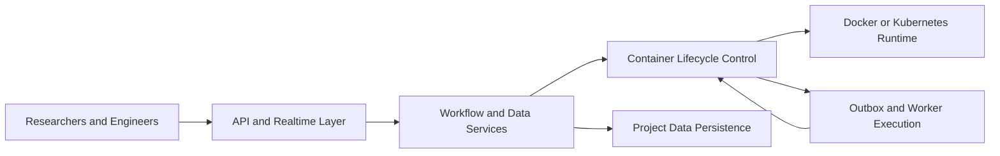

+++
title = 'gobrave - Bioinformatics Analysis Platform'
date = '2026-08-02T00:00:00+08:00'
draft = false
type = 'page'
layout = 'single'
+++

## One Engine. Three Frictions Removed.

Most bioinformatics teams fight the same three frictions:

1. Workflow logic lives in one place, runtime behavior in another.
2. Data lineage is reconstructed after the run, not during the run.
3. Reproducibility depends on tribal knowledge.

**gobrave** is built to remove these frictions at the platform level.
It is a Go-native execution system where workflow, runtime, and data traceability are designed as one model.

## Product Philosophy

### Reproducibility Is A Runtime Property
In gobrave, reproducibility is not a report artifact. It is encoded into execution boundaries, status transitions, and replay-safe orchestration.

### Throughput Without Operational Chaos
Container creation queues, lifecycle transitions, retries, and cleanup policies are part of core behavior, not bolted-on scripts.

### Deterministic First, Adaptive When Needed
Start with static DAG execution. Evolve to dynamic node materialization and reactive streaming without migrating to another platform.

## Capability Map

### Workflow Orchestration
- DAG compiler and scheduler
- Scatter/gather fan-out and merge patterns
- Incremental reruns with cache-aware behavior

### Runtime Control
- Docker, k8s, and k3s runtime abstraction
- Async lifecycle worker with durable outbox events
- Runtime monitor with restart-safe reconciliation

### Data System
- Project-scoped dataset, sample, and file management
- Role-based file resolution for multi-sample analysis
- CRUD and pagination APIs for large-scale data spaces

### Collaboration And Intelligence
- WebSocket and SSE realtime signaling
- LLM bridge for assistant-style analysis workflows
- JWT and API key based access boundaries

## System View



## Why Teams Choose gobrave

- One executable deployment model
- Explicit operational semantics
- Strong project-scoped traceability
- Practical path from deterministic pipelines to dynamic orchestration

## Quick Start

```bash
git clone https://github.com/gobravedev/gobrave.git
cd gobrave
cp config.example.yml config.yml
go build -o gobrave ./cmd/server
./gobrave
```

## Explore Next

- [Quick Start](/docs/quick-start)
- [Configuration](/docs/configuration)
- [Architecture](/docs/architecture)
- [Container Management](/docs/containers)
- [Data Management](/docs/data)
