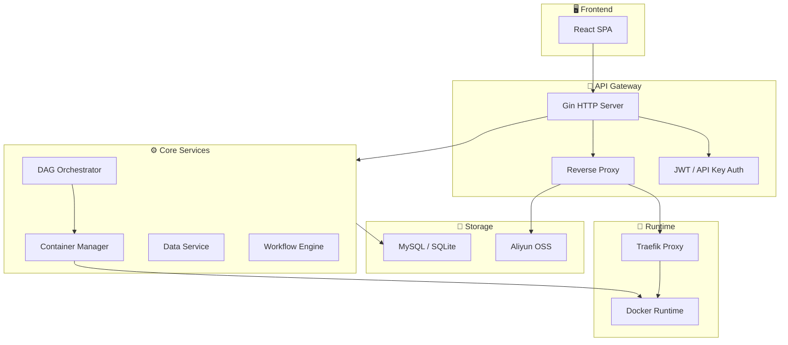

+++
title = 'gobrave - Bioinformatics Analysis Platform'
date = '2026-08-02T00:00:00+08:00'
draft = false
type = 'page'
layout = 'single'
+++

## What is gobrave?

**gobrave** is a high-performance bioinformatics analysis platform built from the ground up in Go. It provides a modern, cloud-native architecture for orchestrating complex computational biology workflows.

## Key Features

### 🧬 DAG-based Workflow Orchestration
Define complex bioinformatics pipelines as Directed Acyclic Graphs (DAGs). gobrave compiles, schedules, and executes each node automatically — supporting scatter/gather patterns, dynamic node expansion, and cache-aware incremental reruns.

### 🐳 Container-native Execution
Every analysis step runs in isolated Docker containers. gobrave manages the full container lifecycle: image pulling, creation, execution, log collection, and cleanup — with configurable auto-cleanup policies.

### 🔄 Dynamic V2/V3 Dataflow Engine
Beyond static DAGs, gobrave offers a dynamic orchestration engine (V2) that materializes nodes at runtime based on upstream results, and a reactive dataflow engine (V3) built on Go channels for streaming pipeline execution.

### 📊 Rich Data Management
Manage samples, files, datasets, and projects with full CRUD APIs. Supports multi-sample analysis with automatic role-based file resolution (FASTQ, BAM, etc.).

### 🤖 LLM Integration
Built-in LLM bridge with Copilot SDK integration. Supports real-time chat via WebSocket, session persistence, and permission-based tool execution — enabling AI-assisted analysis.

### 🌐 Real-time Communication
WebSocket and SSE-based real-time event bus. DAG node status changes, container lifecycle events, and analysis progress are pushed to the frontend in real time.

### 🔐 Multi-tenant Authentication
JWT-based authentication with API key support. Project-scoped data isolation and role-based access control.

### 🚦 Intelligent Routing & Proxy
Built-in reverse proxy with dynamic route registration (Traefik/Gateway/K8s Ingress). Automatic subdomain/path routing for containerized analysis apps (RStudio, Jupyter, VS Code Server).

## Architecture



## Tech Stack

| Component | Technology |
|-----------|-----------|
| Language | Go 1.25+ |
| Web Framework | Gin |
| ORM | GORM |
| Database | MySQL / SQLite |
| Container | Docker SDK |
| DAG Engine | Custom (compiler + scheduler + executor) |
| Template | Pongo2 (Django-like) |
| DI | Uber Dig |
| Reverse Proxy | Traefik / Gateway |
| Real-time | WebSocket / SSE |
| Documentation | Swagger / OpenAPI |

## Quick Start

```bash
# Clone the repository
git clone https://github.com/gobravedev/gobrave.git
cd gobrave

# Copy and edit configuration
cp config.example.yml config.yml

# Build and run
go build -o gobrave ./cmd/server
./gobrave
```

## Project Status

gobrave is under active development. Key capabilities already in production:

- ✅ DAG compilation and execution
- ✅ Container lifecycle management
- ✅ Dynamic V2 orchestration
- ✅ Dataflow V3 engine
- ✅ Multi-sample analysis
- ✅ Real-time event streaming
- ✅ LLM chat integration
- ✅ Route registry (Traefik/Gateway)
- ✅ Analysis node visualization
- ✅ Project-scoped data management

## License

This project is licensed under the terms in the [LICENSE](https://github.com/gobravedev/gobrave/blob/main/LICENSE) file.
