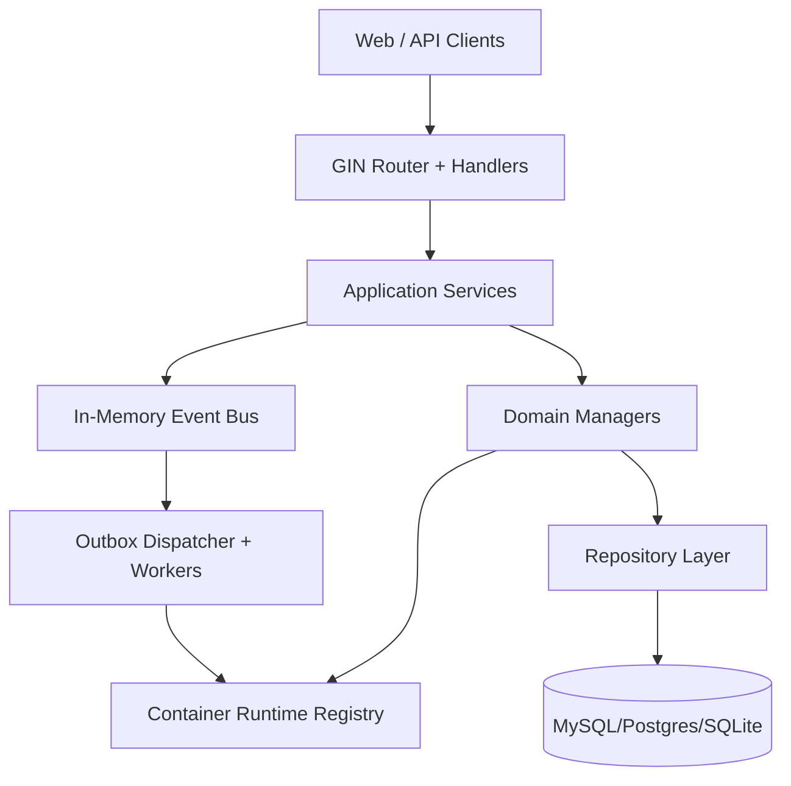

+++
title = 'Architecture'
date = '2026-08-12T00:00:00+08:00'
draft = false
type = 'page'
layout = 'single'
weight = 12
+++

## Overview

gobrave is a modular Go backend centered around project-scoped bioinformatics workflows, data assets, and containerized execution.

## High-Level Components

## Runtime Composition

At startup, gobrave builds a dependency container and wires:

- config loader
- database connection
- repository implementations
- managers/services
- container runtime registry
- router and handlers

This keeps modules replaceable while preserving one executable deployment model.

## Key Subsystems

### API Layer

- Gin router groups domain endpoints (auth, project, data, workflow, container, store)
- API version path: `/api/v1`

### Data And Domain Layer

- Repository-driven persistence using GORM
- Strong ownership boundaries: project, dataset, sample, file, workflow, analysis

### Container Runtime Layer

- Runtime abstraction with pluggable backends: `docker`, `k8s`, `k3s`
- Runtime events are translated into stable container lifecycle transitions

### Eventing And Async Execution

- In-memory event bus for domain event fanout
- Outbox + worker pattern for durable asynchronous lifecycle work

### Realtime Layer

- `ws` and `sse` transport options
- Per-user connection caps and ack retry settings

## Request-To-Execution Path

1. Client invokes API endpoint.
2. Handler validates and calls service/manager.
3. Service persists state transition.
4. For async operations, request is queued via outbox.
5. Worker executes runtime operation and emits events.
6. Manager reconciles state and pushes realtime updates.

## Design Goals

- Single-binary deployment with low operational friction
- Runtime-agnostic container lifecycle management
- Safe restart behavior through reconciliation and durable outbox events
- Project-centric data model compatible with DAG workflow execution
