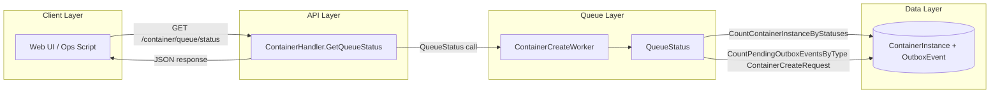

+++
title = 'Container Queue Monitoring'
date = '2026-08-11T00:00:00+08:00'
draft = false
type = 'page'
layout = 'single'
weight = 25
+++

## Overview

This document explains how gobrave exposes container create-queue health, how to interpret each metric, and how the queue status is computed internally.

The monitoring endpoint is designed for operators and UI polling clients that need to answer:

- Is queue mode enabled?
- How many create slots are currently occupied?
- How many create requests are waiting?
- What are the configured hard limits?

## Architecture



### What is measured

- active_count: number of container instances occupying create queue capacity
- pending_count: number of pending create-request outbox events
- max_concurrency: configured concurrent create limit
- max_pending: configured queue depth limit for create requests
- queue_enabled: whether queue-mode worker wiring is available

## API Contract

### Endpoint

- Method: GET
- Path: /container/queue/status
- Auth: Bearer token required

### Response Fields

| Field | Type | Meaning |
|------|------|---------|
| active_count | integer | Current occupied create capacity |
| pending_count | integer | Current pending create requests |
| max_concurrency | integer | Max concurrent create operations |
| max_pending | integer | Max allowed pending create requests |
| queue_enabled | boolean | Queue monitoring availability flag |

### Response modes

The handler returns HTTP 200 in all normal control paths and uses payload values to signal mode:

1. Queue disabled or worker not initialized

```json
{
	"active_count": 0,
	"pending_count": 0,
	"max_concurrency": 0,
	"max_pending": 0,
	"queue_enabled": false
}
```

2. Queue enabled but status read failed

```json
{
	"active_count": -1,
	"pending_count": -1,
	"max_concurrency": 3,
	"max_pending": 50,
	"queue_enabled": true
}
```

3. Queue enabled and status read succeeded

```json
{
	"active_count": 2,
	"pending_count": 7,
	"max_concurrency": 3,
	"max_pending": 50,
	"queue_enabled": true
}
```

## How QueueStatus Is Computed

`QueueStatus` reads both counters inside one repository transaction:

- active_count: count container instances in concurrency-occupied states
- pending_count: count outbox events of type ContainerCreateRequest with pending status

Concurrency-occupied states are:

- creating
- running
- starting
- stopping

This means the active metric is capacity-centric, not only create-in-progress.

## Configuration Mapping

These settings control the values surfaced by monitoring:

```yaml
container:
	create_queue_enabled: false
	create_queue_max_concurrency: 3
	create_queue_max_pending: 50
```

| Config Key | Effect on Monitoring |
|------------|----------------------|
| create_queue_enabled | If disabled, queue worker may not be wired and queue_enabled becomes false |
| create_queue_max_concurrency | Reported as max_concurrency |
| create_queue_max_pending | Reported as max_pending |

## Operational Interpretation

- Healthy and idle: active_count near 0 and pending_count near 0
- Busy but stable: active_count close to max_concurrency while pending_count fluctuates but drains
- Saturated: active_count equals max_concurrency and pending_count grows continuously
- Telemetry degraded: active_count and pending_count both -1

## Recommended Alert Rules

Suggested baseline rules for production:

- Queue saturation: active_count == max_concurrency for 5 minutes
- Queue backlog risk: pending_count >= 0.8 * max_pending for 3 minutes
- Queue full condition: pending_count >= max_pending at any check
- Monitoring read failure: active_count == -1 OR pending_count == -1

## Polling Guidance

- Default polling interval: 5 seconds for UI
- Backoff to 15-30 seconds for low-traffic environments
- If queue_enabled is false, stop queue polling and hide queue load indicators

## Relationship to Runtime Monitoring

Queue monitoring describes admission pressure before or during lifecycle transitions.
Runtime monitoring describes runtime presence and ref-count tracking after containers are managed.

Use both together:

- Queue metrics explain why starts are delayed
- Runtime monitoring explains where active workloads are currently held
