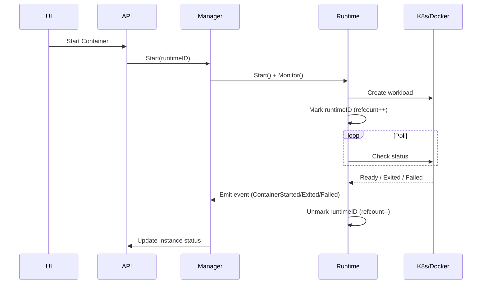

+++
title = 'Container Monitoring'
date = '2026-08-10T00:00:00+08:00'
draft = false
type = 'page'
layout = 'single'
weight = 25
+++

## Container Monitoring

The container monitoring system provides real-time visibility into the runtime state of Docker containers and Kubernetes workloads managed by gobrave.

### Overview

gobrave automatically monitors container lifecycle events — creation, start, exit, and failure — and exposes monitoring status through both the web UI and REST API. A global monitoring registry tracks which containers are currently under active observation.

**Supported runtimes:**

- **Docker**: monitors `docker run` containers from start to exit
- **Kubernetes**: monitors Deployments (pod readiness) and Jobs (completion/failure)

### How It Works



When a container starts, the runtime:

1. Registers the `runtimeID` in the global monitoring registry with a **reference count** (refcount).
2. Spawns a background goroutine to poll the underlying platform (Docker API / Kubernetes API).
3. Emits lifecycle events (`ContainerStarted`, `ContainerExited`, `ContainerFailed`, `ContainerDeleted`) as state changes are detected.
4. Decrements the refcount when monitoring completes.

The refcount mechanism allows multiple concurrent observers for the same runtime. For example, a Kubernetes Job gets one reference from the startup readiness watcher and another from the exit monitor — both are safely tracked and cleaned up independently.

### API Endpoints

#### GET `/container/runtime/monitoring/list`

Returns a snapshot of all currently monitored runtimes.

**Response:**

```json
{
  "data": [
    {"runtime_id": "k8s-default|job|my-job", "ref_count": 1},
    {"runtime_id": "docker-abc123",          "ref_count": 1}
  ],
  "total": 2
}
```

| Field | Description |
|-------|-------------|
| `runtime_id` | Unique identifier for the runtime |
| `ref_count` | Number of active monitoring goroutines |

#### POST `/container/instance/list-by-page`

Each container instance item now includes monitoring metadata:

| Field | Type | Description |
|-------|------|-------------|
| `in_monitoring_registry` | `boolean` | Whether the container is currently being monitored |
| `ref_count` | `number` | Active monitoring reference count |

### Web UI

The **Container Instance List** page displays two additional columns:

- **Monitoring**: `Yes` / `No` — indicates if the container is under active monitoring
- **RefCount**: shows the current monitoring reference count (or `-` if zero)

Use the monitoring API to build custom dashboards and alerting pipelines.

### System Recovery

After a system restart, the `RunRuntimeReconciler` background process:

1. Queries all non-terminal container instances from the database.
2. Cross-references them against the active monitoring registry.
3. Re-attaches monitors for any orphaned containers that should still be tracked.

This ensures that monitoring resumes automatically without manual intervention.

### Architecture

The monitoring registry is designed for extensibility:

- **Interface-based**: `MonitoringRegistry` defines `Mark`, `Unmark`, `IsMonitoring`, `MarkIfNotMonitoring`, and `Snapshot`.
- **In-memory default**: suitable for single-node deployments.
- **Redis-ready**: the interface can be backed by Redis for distributed deployments via dependency injection (`BuildContainer`).
- **Thread-safe**: all operations are atomic under read/write mutexes.
