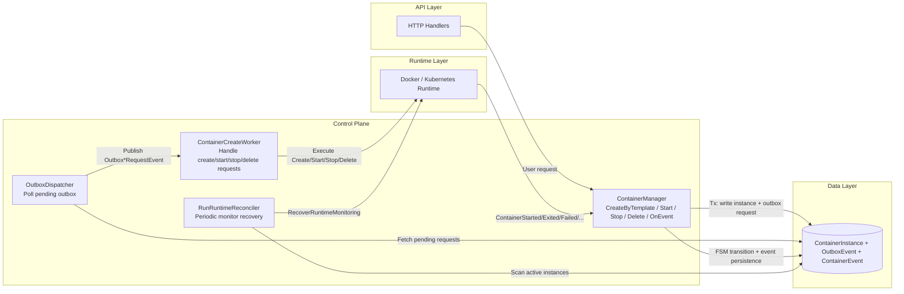
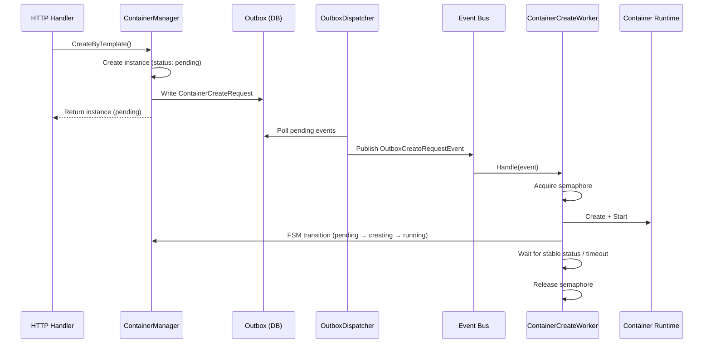
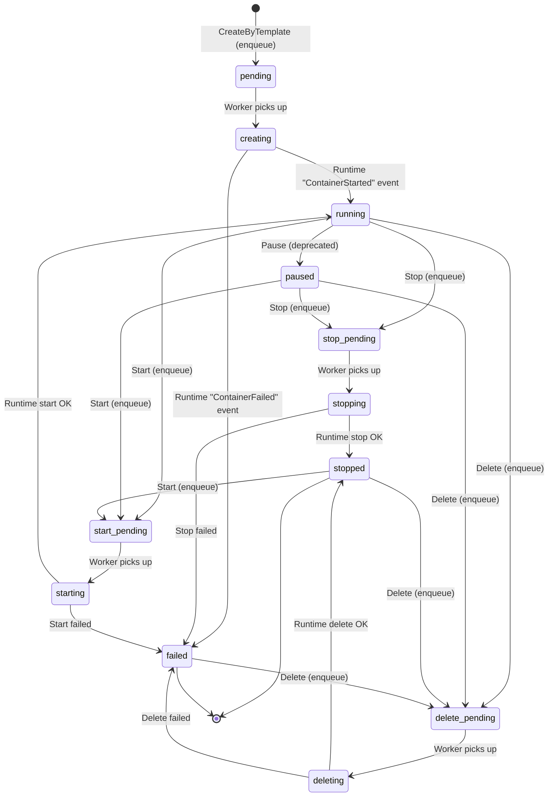
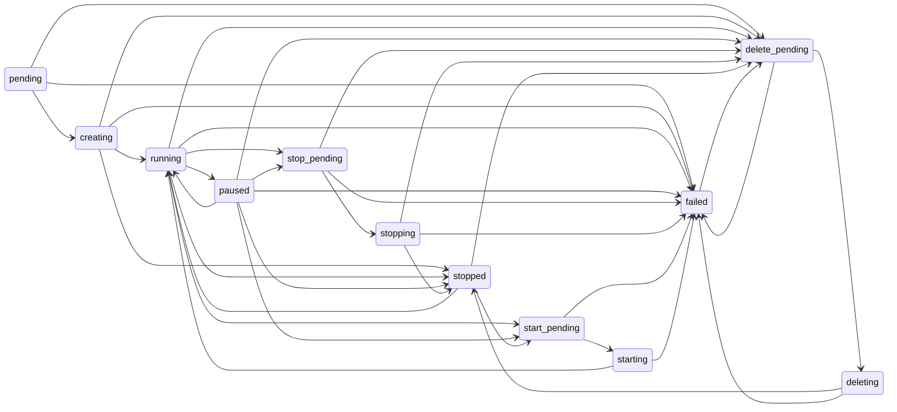

+++
title = 'Container Worker Queue System'
date = '2026-08-11T00:00:00+08:00'
draft = false
type = 'page'
layout = 'single'
weight = 26
+++

## Overview

gobrave uses an outbox-based worker queue to manage all container lifecycle operations asynchronously. Instead of directly calling the container runtime (Docker/K8s), every operation — **create**, **start**, **stop**, and **delete** — is enqueued through the `ContainerCreateWorker` and processed asynchronously via the event bus.

This design provides:

- **Concurrency control** — limits the number of simultaneous container creations via a semaphore.
- **Fault tolerance** — failed operations are retried automatically via the outbox pattern.
- **Consistent state machine** — all operations follow the same FSM-driven lifecycle.
- **Decoupling** — the HTTP handler returns immediately, and the container operation happens in the background.

## Architecture

### Core Component Architecture



This diagram shows three key loops:

- **Request loop**: `ContainerManager` persists requests into outbox, and `OutboxDispatcher` dispatches them to `ContainerCreateWorker`.
- **State loop**: runtime lifecycle events flow back to `ContainerManager.OnEvent`, where FSM transitions and events are persisted.
- **Recovery loop**: `RunRuntimeReconciler` periodically restores monitoring, and during `RecoverRuntimeMonitoring` it backfills runtime node metadata for `running` containers whose `RuntimeNodeName` is empty.

### Create Request Sequence (Detailed View)



All four operations (create, start, stop, delete) follow this same pattern: enqueue → dispatch → process → mark complete.

## Container Lifecycle States

A container instance progresses through the following states:



| State | Description |
|-------|-------------|
| `pending` | Instance created, waiting in create queue |
| `creating` | Worker is creating the runtime container |
| `running` | Container is running |
| `paused` | Container is paused (Docker only, deprecated) |
| `stop_pending` | Stop request enqueued, waiting for worker |
| `stopping` | Worker is stopping the container |
| `stopped` | Container has stopped |
| `start_pending` | Start request enqueued, waiting for worker |
| `starting` | Worker is starting the container |
| `delete_pending` | Delete request enqueued, waiting for worker |
| `deleting` | Worker is deleting the container |
| `failed` | Operation failed |
| `exited` | Container exited on its own |

## Operations

### Create Container

**API**: `POST /api/containers` → `ContainerManager.CreateByTemplate()`

**Flow**:
1. Validates template, image, and runtime
2. Creates `ContainerInstance` with status `pending`
3. Enqueues `ContainerCreateRequest` to outbox
4. Returns instance immediately

**Worker**:
1. Acquires semaphore (controls max concurrency)
2. Prepares image via `ImageManager`
3. Parses env, volumes, and scheduling constraints
4. Resolves runtime variables (e.g., `$USERID`, `$WORKSPACE_PATH`)
5. Calls `rt.Create()` + `rt.Start()`
6. Transitions: `pending` → `creating` → (waits for `ContainerStarted` event → `running`)
7. Releases semaphore after container stabilizes or timeout (5 min)

### Start Container

**API**: `POST /api/containers/:id/start` → `ContainerManager.Start()`

**Flow**:
1. Loads instance from DB
2. Transitions to `start_pending`
3. Enqueues `ContainerStartRequest` to outbox
4. Returns immediately

**Worker**:
1. Resolves runtime from instance
2. Transitions to `starting`
3. Calls `rt.Start()`
4. Runtime emits `ContainerStarted` → `OnEvent` transitions to `running`

### Stop Container

**API**: `POST /api/containers/:id/stop` → `ContainerManager.Stop()`

**Flow**:
1. Loads instance from DB
2. Skips if already in terminal state (`stopped`/`failed`/`exited`)
3. Transitions to `stop_pending`
4. Enqueues `ContainerStopRequest` to outbox
5. Returns immediately

**Worker**:
1. Loads instance and resolves runtime
2. Skips if already terminal
3. Transitions to `stopping`
4. Calls `rt.Stop()`
5. Transitions to `stopped` (sets `FinishedAt`)

### Delete Container

**API**: `DELETE /api/containers/:id` → `ContainerManager.Delete()`

**Flow**:
1. Loads instance from DB
2. Skips if already deleted (`id == 0`)
3. Transitions to `delete_pending`
4. Enqueues `ContainerDeleteRequest` to outbox
5. Returns immediately

**Worker**:
1. Loads instance from DB
2. Transitions to `deleting`
3. Resolves runtime and calls `rt.Delete()`
4. Creates `ContainerDeleted` event
5. Deletes instance from DB

## Outbox Event Types

| Event Type | Used By | Payload |
|------------|---------|---------|
| `ContainerCreateRequest` | Create | `containerCreatePayload` |
| `ContainerStartRequest` | Start | `containerStartPayload` |
| `ContainerStopRequest` | Stop | `containerStopPayload` |
| `ContainerDeleteRequest` | Delete | `containerDeletePayload` |

## Configuration

Configuration is in `config.yml` under the `container` section:

```yaml
container:
  # Refresh container image status when the service starts
  refresh_image_status_on_start: true

  # Recover previously running DAGs when the service starts
  recover_running_dag_on_start: true

  # Remove stale node containers before DAG startup
  cleanup_dag_node_containers_before_start: true

  # Delete the container after a node succeeds
  delete_container_on_node_success: true

  # Cleanup policy when a DAG node fails: none/stop/delete
  dag_node_cleanup_on_failed: stop

  # Cleanup policy when a DAG finishes: none/stop/delete
  dag_node_cleanup_on_dag_finished: delete

  # Maximum number of concurrent container creations
  create_queue_max_concurrency: 3

  # Maximum number of pending creation requests
  create_queue_max_pending: 50
```

| Parameter | Default | Description |
|-----------|---------|-------------|
| `refresh_image_status_on_start` | `true` | Refresh container image status from the runtime when the service starts |
| `recover_running_dag_on_start` | `true` | Recover previously running DAGs after a restart |
| `cleanup_dag_node_containers_before_start` | `true` | Remove stale DAG node containers before starting a new DAG |
| `delete_container_on_node_success` | `true` | Delete the container automatically after a node completes successfully |
| `dag_node_cleanup_on_failed` | `stop` | Cleanup policy when a DAG node fails (`none`, `stop`, or `delete`) |
| `dag_node_cleanup_on_dag_finished` | `delete` | Cleanup policy when a DAG finishes (`none`, `stop`, or `delete`) |
| `create_queue_max_concurrency` | `3` | Max simultaneous container creations |
| `create_queue_max_pending` | `50` | Max queued creation requests before rejecting |

Stop, start, and delete requests do not have queue limits — they are always accepted.

## Error Handling

- If the worker fails to process a request (e.g., runtime error), the outbox event is marked as `pending` for retry.
- The `OutboxDispatcher` polls every second and retries pending events.
- The worker's semaphore prevents resource exhaustion during creation bursts.
- Creation has a 5-minute start timeout; if the container doesn't stabilize within that window, the semaphore is released anyway.

## FSM Transition Rules

The complete FSM is defined in `internal/fsm/container_fsm.go`. Forbidden transitions (e.g., `stopped` → `creating`) return `"invalid transition"` errors.


