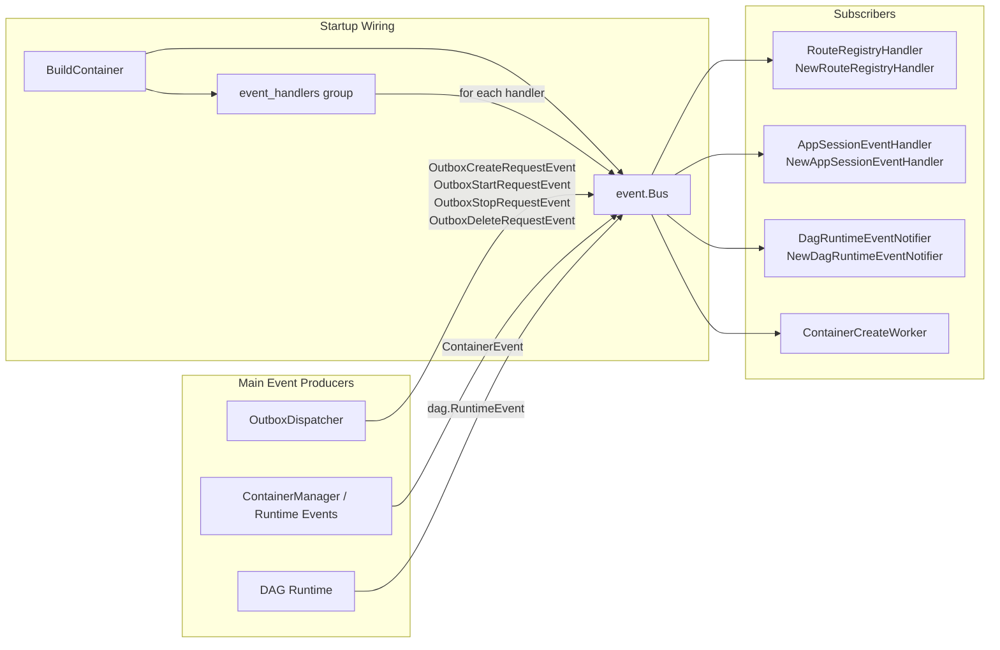

+++
title = 'Event Bus Subscribers (event_handlers)'
date = '2026-08-11T00:00:00+08:00'
draft = false
type = 'page'
layout = 'single'
weight = 27
+++

## Overview

This document explains the user-facing architecture for all handlers subscribed to the shared event bus through the event_handlers DI group.

Registered subscribers in this group are:

- NewRouteRegistryHandler
- NewAppSessionEventHandler
- NewDagRuntimeEventNotifier
- ContainerCreateWorker

These handlers are all subscribed during startup by iterating the event_handlers group and calling bus.Subscribe(handler).

## Subscription Architecture

## What Each Subscriber Does

### 1) NewRouteRegistryHandler

Primary role: keeps external route records in sync with App Session container lifecycle.

- Consumes: ContainerEvent
- Scope: only containers owned by app_session
- On ContainerStarted / ContainerResumed:
  - Builds backend route from container IP and template port
  - Upserts route into configured route registry (gateway, Traefik, or K8s ingress adapter)
- On ContainerStopped / ContainerDeleted / ContainerFailed:
  - Deletes route from registry

User impact:

- App session URLs become reachable only when containers are actually ready.
- Routes are automatically removed when containers stop or fail, avoiding stale traffic targets.

### 2) NewAppSessionEventHandler

Primary role: maps container lifecycle events to AppSession status for UI and API consistency.

- Consumes: ContainerEvent
- Scope: only containers owned by app_session
- Normalizes events (creating/running/stopped/failed)
- Updates AppSession fields:
  - Status
  - StartedAt
  - StoppedAt

User impact:

- App session status shown in UI reflects real container state transitions.
- Start/stop timestamps stay aligned with runtime behavior.

### 3) NewDagRuntimeEventNotifier

Primary role: transforms DAG runtime events into realtime UI action messages.

- Consumes: dag.RuntimeEvent
- Filters to major DAG and node lifecycle events
- Resolves project users and pushes messages through realtime Hub
- Emits frontend action payloads such as:
  - dagStarted
  - dagDone
  - analysisSubmitted
  - analysisStarted
  - analysisDone

User impact:

- Users in the same project receive near-real-time DAG and node state updates.
- DAG progress can update without page refresh.

### 4) ContainerCreateWorker

Primary role: executes deferred container operations from outbox request events with queue control.

- Consumes:
  - OutboxCreateRequestEvent
  - OutboxStartRequestEvent
  - OutboxStopRequestEvent
  - OutboxDeleteRequestEvent
- Performs runtime operations asynchronously:
  - create + start
  - start
  - stop
  - delete
- Coordinates state transitions and outbox status updates
- Enforces create queue limits (max concurrency and max pending)

User impact:

- Container APIs return quickly while heavy runtime operations run in background.
- System remains stable under burst workloads via queue backpressure.
- Failed operations can be retried by outbox status transitions.

## Event-to-Subscriber Matrix

| Event Type | RouteRegistryHandler | AppSessionEventHandler | DagRuntimeEventNotifier | ContainerCreateWorker |
|------------|----------------------|------------------------|-------------------------|-----------------------|
| ContainerEvent | Yes | Yes | No | No |
| dag.RuntimeEvent | No | No | Yes | No |
| OutboxCreateRequestEvent | No | No | No | Yes |
| OutboxStartRequestEvent | No | No | No | Yes |
| OutboxStopRequestEvent | No | No | No | Yes |
| OutboxDeleteRequestEvent | No | No | No | Yes |

## End-to-End User Story

1. A user starts an app session or runs a DAG node.
2. The system writes lifecycle and outbox events.
3. OutboxDispatcher and runtime components publish events into the shared bus.
4. Different subscribers react independently:
   - ContainerCreateWorker executes runtime actions.
   - AppSessionEventHandler updates app session status.
   - RouteRegistryHandler syncs route availability.
   - DagRuntimeEventNotifier pushes realtime UI updates.
5. The user sees consistent status, route availability, and live progress.

This separation keeps the architecture event-driven, decoupled, and easier to extend.
