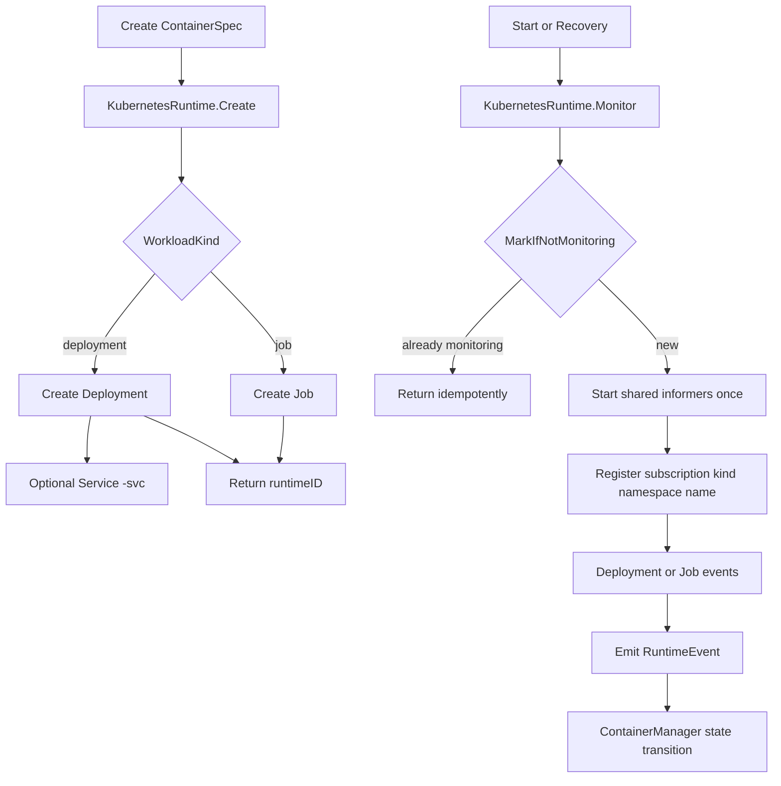

+++
title = 'Kubernetes Runtime Architecture'
date = '2026-08-12T00:00:00+08:00'
draft = false
type = 'page'
layout = 'single'
weight = 27
+++

## Overview

This document explains the current Kubernetes runtime architecture used by gobrave.

It is based on the runtime implementation in:

- `internal/container_runtime/kubernetes/runtime.go`
- `internal/container_runtime/kubernetes/monitor_v2.go`

The runtime supports two workload kinds:

- `deployment` (long-running service)
- `job` (run-to-completion task)

## Architecture Goals

1. Keep runtime monitoring efficient at scale.
2. Avoid duplicate monitor loops for the same runtime ID.
3. Convert Kubernetes workload state into stable gobrave runtime events.
4. Keep lifecycle behavior predictable for users (`start`, `stop`, `delete`, `logs`, `inspect`).

## High-Level Flow

## Runtime ID Model

Runtime IDs are encoded as:

`<runtimeName>-<namespace>|<kind>|<name>`

Examples:

- `k8s-default|deployment|web-api`
- `k3s-ai|job|batch-import-001`

This format is required by runtime operations such as `Start`, `Stop`, `Delete`, `Logs`, and `Inspect`.

## Resource Creation Model

### Deployment Path

When `WorkloadKind` is `deployment` (or empty, default):

1. Create Deployment with labels:
- `app=<workloadName>`
- `gobrave-workload=<workloadName>`
2. If `ExposeService=true` and `ExposedPort>0`, create ClusterIP Service named `<workloadName>-svc`.
3. Return runtime ID.

### Job Path

When `WorkloadKind` is `job`:

1. Create Job with labels:
- `app=<workloadName>`
- `gobrave-workload=<workloadName>`
2. Return runtime ID.

### Namespace Resolution

Namespace priority:

1. `spec.RuntimeNamespace`
2. runtime config namespace
3. `default`

## Pod Spec Mapping (User-Facing Behavior)

From `ContainerSpec` to Kubernetes Pod spec:

- `Image`, `Entrypoint`, `Command`, `WorkDir` map directly.
- `Env` is sorted by key before injection (deterministic output).
- `CPU` and `Memory` are mapped to container limits.
- `Volumes` are mapped as `hostPath` mounts.
- `User` (numeric uid or `uid:gid`) is mapped to `RunAsUser` when parsable.
- `ExposedPort` adds container port.
- Scheduling constraints of type `node` are mapped into required node affinity.

Restart policy:

- Deployment: `Always`
- Job: `Never`

## Monitor Architecture (Informer-Driven)

`KubernetesRuntime` uses `monitor_v2` by default.

### Key Design

1. Shared informer startup happens once per runtime process.
2. Monitor registration is idempotent via `MarkIfNotMonitoring(runtimeID)`.
3. Subscriptions are keyed by `kind|namespace|name`.
4. A one-time snapshot check is executed right after subscription registration.

### Informers Used

- Deployment informer: add/update/delete
- Job informer: add/update/delete

### Why Snapshot Check Exists

Before waiting for informer updates, runtime performs a direct `Get` for the target workload.
This avoids missing terminal/start signals that may have happened just before registration.

## Event Mapping

The runtime emits these events to `ContainerManager`:

### Job

- Started: `Status.Active > 0` or `Status.StartTime != nil` -> `ContainerStarted`
- Succeeded: `Status.Succeeded > 0` -> `ContainerExited` with message `0`
- Failed: `Status.Failed > 0` -> `ContainerFailed` with condition message or failed count
- Deleted/NotFound: delete event or lookup not found -> `ContainerDeleted`

### Deployment

- Started: `Status.ReadyReplicas > 0` -> `ContainerStarted`
- Failed: replica failure/progress deadline exceeded -> `ContainerFailed`
- Exited: `spec.replicas == 0` and `status.replicas == 0` -> `ContainerExited` with message `0`
- Deleted/NotFound: delete event or lookup not found -> `ContainerDeleted`

After a terminal event is emitted, the subscription is removed and monitor membership is unmarked.

## Lifecycle Semantics

### Start

- Deployment: scale to 1, then monitor.
- Job: verify Job exists, then monitor.

### Stop and Pause

- Deployment: scale to 0.
- Job: delete Job (foreground propagation).
- `Pause` is implemented as `Stop`.

### Resume

- `Resume` is implemented as `Start`.

### Delete

- Deployment: delete Service `<name>-svc` (ignore not found), then delete Deployment.
- Job: delete Job (foreground propagation).

## Logs and Inspect

### Logs

`Logs(runtimeID, tail)`:

1. Resolve workload metadata from runtime ID.
2. Find latest Pod by label `gobrave-workload=<name>`.
3. Read pod logs (default tail: 200 lines).

### Inspect

- Deployment:
    - `IPAddress` is returned as service DNS: `<name>-svc.<namespace>.svc.cluster.local`
    - `NodeName` comes from latest Pod when available
- Job:
    - `IPAddress` is Pod IP
    - `NodeName` is Pod node

## Limitations and Compatibility Notes

- Supported runtime names: `k8s`, `k3s`.
- `EnsureImage` accepts pull policy `Always` and `IfNotPresent`.
- Pull policy `Never` is rejected for preflight validation.
- `Exec` is currently not implemented.
- A deleted Job is not restartable as the same workload.

## Operational Recommendations

1. Always keep `gobrave-workload` label on managed workloads.
2. Use one runtime process with shared informers rather than per-workload clients.
3. Treat monitor registration as safe to call repeatedly.
4. Keep restart recovery enabled so non-terminal runtime IDs are reattached after process restarts.

## Troubleshooting Checklist

1. No lifecycle updates are arriving:
- Check runtime ID format and runtime prefix (`k8s-` or `k3s-`).
- Check informer startup/cache sync errors.

2. Deployment never reports started:
- Check `ReadyReplicas` and pod scheduling status.
- Check deployment failure conditions (`ReplicaFailure`, `ProgressDeadlineExceeded`).

3. Job did not emit terminal event:
- Check `Succeeded` / `Failed` status fields and Job conditions.
- Check whether the Job was deleted before monitor registration.

## Related Documents

- Runtime monitor recovery: `/docs/runtime-monitor-recovery`
- Container monitoring and queue status: `/docs/container-monitoring`
- Event subscribers: `/docs/event-bus-subscribers`
