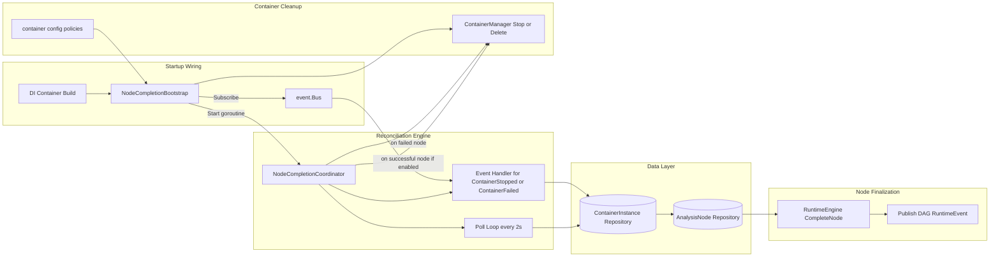

+++
title = 'Node Completion Bootstrap'
date = '2026-08-11T00:00:00+08:00'
draft = false
type = 'page'
layout = 'single'
weight = 28
+++

## Overview

NodeCompletionBootstrap is the startup wiring component that guarantees DAG analysis nodes are eventually finalized when their runtime containers reach terminal states.

It separates infrastructure concerns from DAG orchestration logic by:

- constructing NodeCompletionCoordinator with cleanup policies
- subscribing the coordinator to container lifecycle events
- starting a background poll loop for reconciliation fallback

This ensures node finalization still happens after process restarts, missed events, or transient bus delivery gaps.

## Architecture



## Startup Lifecycle

At application startup:

1. DI registers NodeCompletionBootstrap.
2. Startup invoke calls bootstrap.Start(context.Background()).
3. Start is guarded by sync.Once, so duplicate startup calls are ignored.
4. The coordinator is subscribed to the shared event bus.
5. A background reconciliation loop starts and runs every 2 seconds.

This dual model (event-driven + polling) provides both low latency and eventual consistency.

## Reconciliation Triggers

NodeCompletionCoordinator reconciles DAG node completion from two sources:

- Event trigger:
  - handles ContainerStopped
  - handles ContainerFailed
- Poll trigger:
  - periodically scans container instances
  - reconciles terminal DAG-node containers (stopped, failed, exited)

An in-flight guard (per container instance ID) prevents duplicate concurrent reconciliations.

## Completion Decision Logic

For each terminal DAG-node container, coordinator:

1. loads the owning analysis node
2. ignores non-runnable node states
3. maps container terminal state to node final state
4. resolves node outputs from output patterns and outputs.json
5. completes the node via RuntimeEngine.CompleteNode
6. publishes runtime event for UI and downstream consumers

Status mapping:

- ContainerFailed -> failed (exit code defaults to 1 when missing)
- ContainerStopped or ContainerExited + exit code 0 -> done
- ContainerStopped or ContainerExited + non-zero exit code -> failed
- if node status is stopping and container is terminal -> stopped

## Cleanup Responsibilities

NodeCompletionBootstrap injects cleanup behavior into coordinator.

### On node failed

Cleanup policy comes from container.dag_node_cleanup_on_failed:

- none: do nothing
- stop: stop node-owned containers
- delete: delete node-owned containers

The bootstrap queries all container instances owned by the failed node and applies the selected policy through ContainerManager.

### On node success

If container.delete_container_on_node_success is true, the coordinator deletes the successful node container.

## Configuration

Relevant container settings:

```yaml
container:
  delete_container_on_node_success: true
  dag_node_cleanup_on_failed: stop
```

Behavioral meaning:

- delete_container_on_node_success controls post-success container deletion
- dag_node_cleanup_on_failed controls failed-node cleanup mode (none/stop/delete)

## End-to-End User Story

1. A DAG node runs in a runtime container.
2. The container exits (normal or failure).
3. Coordinator receives a bus event immediately, or catches it on polling.
4. Coordinator finalizes node status and outputs.
5. Optional cleanup policy is executed.
6. RuntimeEvent is published for realtime UI updates.

Result: users see consistent DAG node terminal states even across restarts or temporary event-delivery gaps.