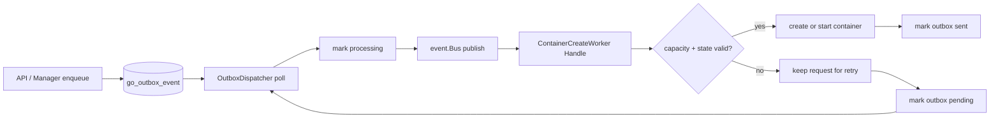

+++
title = 'Outbox Dispatcher and Worker Concurrency'
date = '2026-08-11T00:00:00+08:00'
draft = false
type = 'page'
layout = 'single'
weight = 28
+++

## Overview

This document explains how `RunOutboxDispatcher`, `OutboxDispatcher`, and `ContainerCreateWorker`
work together to implement queue backpressure and runtime concurrency control for `ContainerInstance`.

The key goals are:

- Limit how many container create/start operations can run at the same time (`maxConcurrency`).
- Limit how many create requests can wait in queue (`maxPending`).
- Keep requests asynchronous by using `OutboxEvent` + event bus.

## Components and Responsibilities

### `RunOutboxDispatcher`

- Starts the dispatcher loop in a goroutine.
- Calls `dispatcher.Start(context.Background())` asynchronously.

```go
func RunOutboxDispatcher(dispatcher *OutboxDispatcher) {
    go dispatcher.Start(context.Background())
}
```

### `OutboxDispatcher`

- Polls pending outbox rows (`ListPendingOutboxEvent`).
- Marks each request as `processing` before publish.
- Publishes typed request events to the event bus:
  - `OutboxCreateRequestEvent`
  - `OutboxStartRequestEvent`
  - `OutboxStopRequestEvent`
  - `OutboxDeleteRequestEvent`

### `ContainerCreateWorker`

- Subscribes to bus events above.
- Handles create/start/stop/delete asynchronously.
- For create/start requests, uses capacity checks via `acquireCapacityAndTransition`.
- Marks outbox `sent` on success, or back to `pending` on retriable failure.

## Event Bus Flow



## `ContainerInstance` Status and Queue Behavior

### Create request path

1. A create API path performs queue check and enqueue in a single DB transaction.
2. The transaction checks pending create requests against `maxPending`.
3. If pending create requests are already greater than or equal to `maxPending`, the transaction returns error and rolls back, so no `ContainerInstance` and no `OutboxEvent` are created.
4. If accepted, the same transaction writes:
  - `ContainerInstance{status: pending}`
  - `OutboxEvent{Type: ContainerCreateRequest, Status: pending}`
5. `OutboxDispatcher` publishes `OutboxCreateRequestEvent`.
6. `ContainerCreateWorker` handles the event and calls `acquireCapacityAndTransition`.

### Capacity decision (`maxConcurrency`)

- The worker counts active container instances occupying concurrency slots.
- If active count is less than `maxConcurrency`, transition is allowed and container goes to `creating`, then `running`.
- If active count is greater than or equal to `maxConcurrency`, capacity is denied and request is not executed in this round.

Result when denied:

- Current `ContainerInstance` remains `pending` (or pending-start for start flow).
- Corresponding outbox request is returned to `pending`.
- Next `OutboxDispatcher` poll will retry.

## State Transition Summary

For the create lifecycle discussed here:

- `pending` -> `creating` -> `running` (when capacity is available)
- `pending` -> `pending` (logical retry, when capacity is not available in current round)

For start lifecycle in this same mechanism:

- `start_pending` -> `starting` -> `running` (when capacity is available)
- `start_pending` -> `start_pending` (logical retry, when capacity is not available)

## `maxPending` and `maxConcurrency` Together

- `maxPending` protects queue length at enqueue time.
- `maxConcurrency` protects runtime pressure at execution time.
- Combined behavior:
  - Queue too long: reject new create request immediately (no `OutboxEvent` created).
  - Queue accepted but runtime busy: request stays retryable and will be attempted by next dispatcher cycle.

This gives bounded queue growth plus bounded concurrent runtime operations.