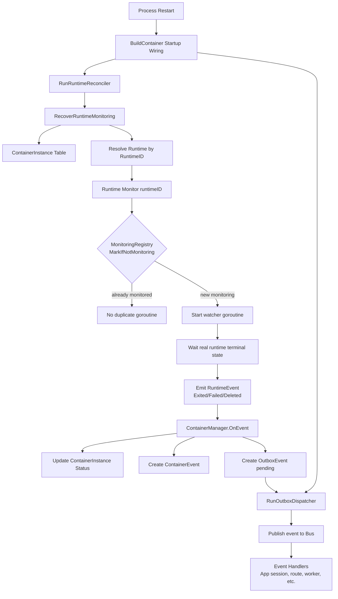

+++
title = 'Runtime Monitor Recovery After Restart'
date = '2026-08-11T00:00:00+08:00'
draft = false
type = 'page'
layout = 'single'
weight = 26
+++

## Overview

This document explains how gobrave restores runtime monitor goroutines after a process restart, using:

- `RunRuntimeReconciler` for periodic recovery
- `MonitoringRegistry` for idempotent monitor membership
- runtime `Monitor(...)` implementations that relaunch goroutines per runtime

The goal is to keep `ContainerInstance` state aligned with the real runtime state and ensure terminal container events are delivered into the event pipeline.

## Why Recovery Is Needed

After a service restart, in-memory goroutines are lost, including runtime exit watchers.
Without recovery, a container could finish in the runtime while its persisted `ContainerInstance` remains `running` or `creating`.

## Startup And Periodic Recovery

At startup, dependency wiring invokes:

- `ContainerManager.RunRuntimeReconciler(context.Background(), 30*time.Second)`

`RunRuntimeReconciler` performs:

1. Immediate recovery once at startup
2. Periodic recovery every interval (default 30s)

Each recovery cycle calls `RecoverRuntimeMonitoring`, which:

- Reads persisted `ContainerInstance` records
- Filters records eligible for monitoring recovery (`creating`, `paused`, `running`, and non-empty runtime ID)
- Resolves the corresponding runtime implementation
- Calls runtime `Monitor(ctx, runtimeID)` when the runtime supports `RuntimeMonitor`

## Role Of MonitoringRegistry

`MonitoringRegistry` guards monitor goroutine membership and avoids duplicate watchers:

- `MarkIfNotMonitoring(runtimeID)` atomically marks membership only if absent
- Repeated recoveries for the same runtime ID are safe and idempotent
- `Unmark(runtimeID)` is called when watcher goroutines exit
- `Snapshot()` can expose current monitor reference counts for diagnostics

This means the reconciler can run repeatedly without spawning unbounded duplicate goroutines.

## Runtime Monitor Behavior

Runtime implementations (`docker`, `k8s/k3s`) call `MarkIfNotMonitoring` before starting a watcher goroutine.
If already monitored, they return early.

Typical watcher behavior:

- Wait for container/workload terminal state
- Emit runtime event (`ContainerExited`, `ContainerFailed`, `ContainerDeleted`, etc.)
- Unmark monitoring membership on goroutine exit

## State Consistency: ContainerInstance vs Real Runtime

When runtime events arrive at `ContainerManager.OnEvent(...)`, manager transitions persisted `ContainerInstance` state:

- `ContainerStarted` -> `running`
- `ContainerExited` -> `stopped`
- `ContainerFailed` -> `failed`
- `ContainerDeleted` -> `stopped`

Transition logic updates:

- instance status
- started/finished timestamps when relevant
- container event records

This keeps persisted state consistent with actual runtime completion signals.

## Event Delivery To Bus

For transition events, manager writes an outbox record (`pending`) with serialized `ContainerEvent` payload.
Then the outbox dispatcher publishes those events to the bus, so downstream handlers can react even after restarts.

Because both reconciler and outbox dispatcher run at startup, terminal events observed after monitor recovery are still propagated through the normal event pipeline.

## Architecture

## Operational Notes

- Recovery is eventually consistent, not instantaneous; bounded by reconciler interval.
- Duplicate monitor creation is prevented by registry atomic check.
- Terminal state propagation remains durable because transition events are persisted before bus dispatch.
- If a runtime does not implement `RuntimeMonitor`, that runtime is skipped by recovery logic.
