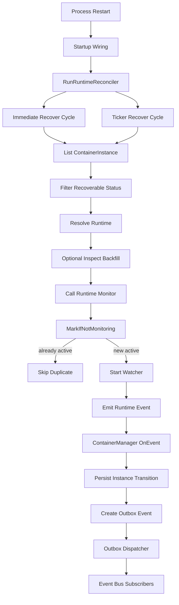

+++
title = 'Runtime Monitor Recovery After Restart'
date = '2026-08-11T00:00:00+08:00'
draft = false
type = 'page'
layout = 'single'
weight = 26
+++

## Overview

This document explains how gobrave restores runtime lifecycle monitoring after a process restart.

The current recovery path is based on:

- `ContainerManager.RunRuntimeReconciler(...)`
- `ContainerManager.RecoverRuntimeMonitoring(...)`
- runtime `Monitor(ctx, runtimeID)` implementations
- process-global `MonitoringRegistry` idempotency guard

The goal is to reattach monitoring for recoverable container instances and continue emitting runtime events into the normal state transition pipeline.

## Why Recovery Is Needed

After service restart, in-memory monitor goroutines are lost.
Without recovery, runtime state can change while persisted `ContainerInstance` status stays stale.

## Startup And Periodic Recovery

Startup wiring invokes:

- `ContainerManager.RunRuntimeReconciler(context.Background(), 600*time.Second)`

`RunRuntimeReconciler` performs:

1. Immediate recovery once at startup
2. Periodic recovery every configured interval

If `interval <= 0`, the reconciler falls back to `300s`.

Each recovery cycle calls `RecoverRuntimeMonitoring`, which:

- Reads persisted `ContainerInstance` records
- Filters records eligible for monitoring recovery
- Resolves runtime implementation from instance runtime information
- Optionally backfills runtime inspect data for running instances
- Calls runtime `Monitor(ctx, runtimeID)` when runtime supports `RuntimeMonitor`
- Logs per-instance recover success or failure and continues scanning

Eligible statuses are:

- `creating`
- `paused`
- `running`
- `failed`

Instances with empty runtime ID are skipped.

## Role Of MonitoringRegistry

`MonitoringRegistry` guards monitor goroutine membership and avoids duplicate watchers:

- `MarkIfNotMonitoring(runtimeID)` atomically marks membership only if absent
- Repeated recoveries for the same runtime ID are safe and idempotent
- `UnmarkRuntimeMonitoring(runtimeID)` is called when watcher exits or subscription completes
- `RuntimeMonitoringSnapshot()` exposes runtime ID to count mapping for diagnostics

This lets reconciler run repeatedly without creating duplicate active monitors.

## Runtime Monitor Behavior

Runtime implementations (`docker`, `k8s/k3s`) call `MarkIfNotMonitoring` before starting a watcher goroutine.
If already monitored, they return early.

Typical watcher behavior:

- Wait for container/workload terminal state
- Emit runtime event (`ContainerExited`, `ContainerFailed`, `ContainerDeleted`, etc.)
- Unmark monitoring membership on goroutine exit

## Runtime Inspect Backfill During Recovery

Before calling `Monitor`, recovery performs best-effort inspect sync only when all conditions are true:

- instance status is `running`
- runtime ID is not empty
- `RuntimeNodeName` is empty

If runtime supports `RuntimeInspector`, manager calls `Inspect` and persists changed `IPAddress` or `RuntimeNodeName`.

## State Consistency And Event Pipeline

Recovery itself does not emit synthetic reconciliation events.
State changes continue to flow through runtime monitor events handled by `ContainerManager.OnEvent`.

Typical transitions are:

- `ContainerStarted` -> `running`
- `ContainerExited` -> `stopped`
- `ContainerFailed` -> `failed`
- `ContainerDeleted` -> `stopped`

Transition handling persists container instance updates and writes outbox events for downstream subscribers.

## Event Delivery To Bus

For transition events, manager writes outbox records with serialized container event payloads.
Then the outbox dispatcher publishes those events to the bus, so downstream handlers can react even after restarts.

Because reconciler and dispatcher run at startup, post-recovery runtime events are delivered through the same durable pipeline.

## Architecture

## Operational Notes

1. Recovery is eventually consistent and bounded by reconciler interval.
2. Startup cycle always runs once immediately after reconciler starts.
3. Periodic cycle logs success only when `recovered > 0`.
4. If one instance fails to recover, scan continues for remaining instances.
5. If runtime does not implement `RuntimeMonitor`, instance is skipped.
6. Monitoring dedup is guaranteed by `MarkIfNotMonitoring`.

## Troubleshooting Checklist

1. Startup recovery did not run:
- Check startup logs for `startup runtime monitor recovery` entries.
- Verify `RunRuntimeReconciler` wiring in container bootstrap.

2. Instance is skipped unexpectedly:
- Check status is one of `creating`, `paused`, `running`, `failed`.
- Check runtime ID is not empty.
- Check runtime can be resolved by instance runtime metadata.

3. No periodic recovery logs:
- Periodic success logs appear only when recovered count is greater than zero.
- Check warning logs for periodic failures.

4. Duplicate monitor concern:
- Use runtime monitoring snapshot endpoint to verify current monitored runtime IDs and counts.
