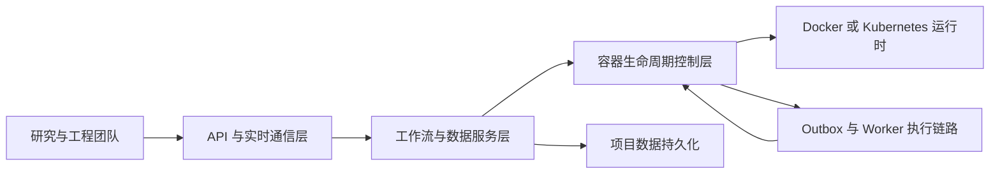

+++
title = 'gobrave - 生物信息学分析平台'
date = '2026-08-02T00:00:00+08:00'
draft = false
type = 'page'
layout = 'single'
+++

## 一个执行引擎，消除三类断层

生信团队普遍会遇到三类断层：

1. 工作流定义和运行时行为分离，出了问题很难追。
2. 数据血缘依赖事后拼接，而不是执行时固化。
3. 可复现性常常依赖经验，而不是平台机制。

**gobrave** 的目标不是再做一个流程界面，而是把工作流、运行时、数据追踪收敛为同一个执行模型。

## 产品主张

### 可复现性不是附加产物，而是运行时属性
在 gobrave 中，状态迁移、执行边界和恢复路径都是一等对象，可追踪、可回放、可对账。

### 高吞吐不应牺牲可运维性
容器创建队列、生命周期事件、重试与清理策略都在核心模型内，而不是靠脚本补洞。

### 先确定性，再渐进式动态化
你可以从静态 DAG 起步，再平滑升级到动态节点实例化与响应式数据流，无需迁移平台。

## 能力地图

### 工作流编排
- DAG 编译与调度
- Scatter/Gather 扇出归并
- 缓存感知的增量重跑

### 运行时控制
- Docker、k8s、k3s 统一抽象
- 基于 outbox 的异步生命周期 worker
- 支持重启恢复的运行时监控与对账

### 数据系统
- 项目级 dataset、sample、file 管理
- 面向多样本分析的角色化文件解析
- 面向大规模数据空间的分页与 CRUD API

### 协作与智能化
- WebSocket/SSE 实时状态广播
- LLM bridge 支持助理式分析交互
- JWT 与 API Key 的访问边界控制

## 系统视图



## 为什么团队选择 gobrave

- 单可执行部署，降低交付复杂度
- 明确的运行语义，减少黑盒行为
- 强项目作用域追踪，便于审计与复现
- 从确定性流程到动态编排的可演进路径

## 快速开始

```bash
git clone https://github.com/gobravedev/gobrave.git
cd gobrave
cp config.example.yml config.yml
go build -o gobrave ./cmd/server
./gobrave
```

## 继续阅读

- [快速开始](/zh/docs/quick-start)
- [配置说明](/zh/docs/configuration)
- [系统架构](/zh/docs/architecture)
- [容器管理](/zh/docs/containers)
- [数据管理](/zh/docs/data)
