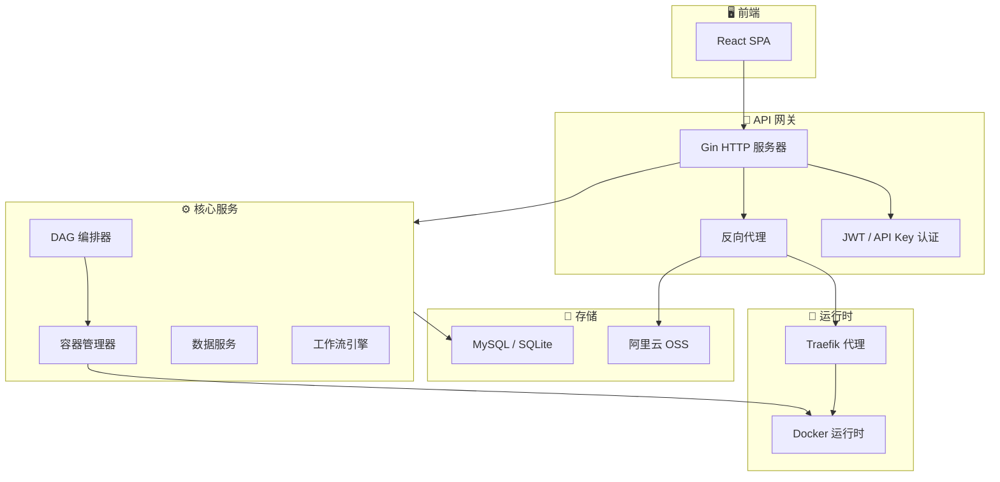

+++
title = 'gobrave - 生物信息学分析平台'
date = '2026-08-02T00:00:00+08:00'
draft = false
type = 'page'
layout = 'single'
+++

## 什么是 gobrave？

**gobrave** 是一个用 Go 语言从零构建的高性能生物信息学分析平台。它提供了现代化的云原生架构，用于编排复杂的计算生物学工作流。

## 核心功能

### 🧬 基于 DAG 的工作流编排
将复杂的生物信息学流程定义为有向无环图（DAG）。gobrave 自动编译、调度和执行每个节点——支持 scatter/gather 模式、动态节点展开以及缓存感知的增量重跑。

### 🐳 容器原生执行
每个分析步骤都在隔离的 Docker 容器中运行。gobrave 管理完整的容器生命周期：镜像拉取、创建、执行、日志收集和清理——支持可配置的自动清理策略。

### 🔄 动态 V2/V3 数据流引擎
除了静态 DAG，gobrave 还提供了动态编排引擎（V2），可在运行时根据上游结果实例化节点；以及基于 Go channel 构建的响应式数据流引擎（V3），用于流式管道执行。

### 📊 丰富的数据管理
通过完整的 CRUD API 管理样本、文件、数据集和项目。支持多样本分析，具有自动的基于角色的文件解析（FASTQ、BAM 等）。

### 🤖 LLM 集成
内置 LLM 桥接器，集成 Copilot SDK。支持通过 WebSocket 进行实时聊天、会话持久化和基于权限的工具执行——实现 AI 辅助分析。

### 🌐 实时通信
基于 WebSocket 和 SSE 的实时事件总线。DAG 节点状态变更、容器生命周期事件和分析进度实时推送到前端。

### 🔐 多租户认证
基于 JWT 的认证，支持 API Key。项目范围的数据隔离和基于角色的访问控制。

### 🚦 智能路由与代理
内置反向代理，支持动态路由注册（Traefik/Gateway/K8s Ingress）。为容器化分析应用（RStudio、Jupyter、VS Code Server）自动配置子域名/路径路由。

## 架构



## 技术栈

| 组件 | 技术 |
|-----------|-----------|
| 编程语言 | Go 1.25+ |
| Web 框架 | Gin |
| ORM | GORM |
| 数据库 | MySQL / SQLite |
| 容器 | Docker SDK |
| DAG 引擎 | 自研（编译器 + 调度器 + 执行器）|
| 模板引擎 | Pongo2（类 Django）|
| 依赖注入 | Uber Dig |
| 反向代理 | Traefik / Gateway |
| 实时通信 | WebSocket / SSE |
| 文档 | Swagger / OpenAPI |

## 快速开始

```bash
# 克隆仓库
git clone https://github.com/gobravedev/gobrave.git
cd gobrave

# 复制并编辑配置
cp config.example.yml config.yml

# 构建并运行
go build -o gobrave ./cmd/server
./gobrave
```

## 项目状态

gobrave 正在积极开发中。以下关键功能已在生产环境中运行：

- ✅ DAG 编译与执行
- ✅ 容器生命周期管理
- ✅ 动态 V2 编排
- ✅ 数据流 V3 引擎
- ✅ 多样本分析
- ✅ 实时事件流
- ✅ LLM 聊天集成
- ✅ 路由注册（Traefik/Gateway）
- ✅ 分析节点可视化
- ✅ 项目范围数据管理

## 许可证

本项目遵循 [LICENSE](https://github.com/gobravedev/gobrave/blob/main/LICENSE) 文件中的条款。
