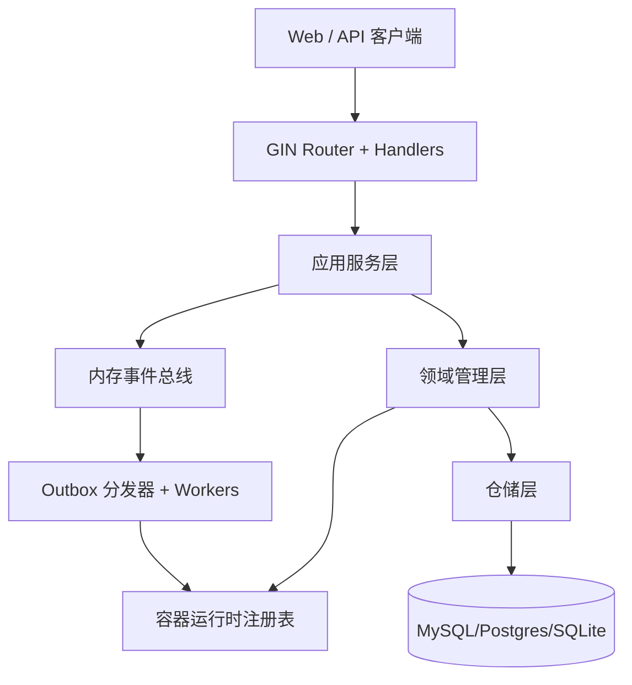

+++
title = '系统架构'
date = '2026-08-12T00:00:00+08:00'
draft = false
type = 'page'
layout = 'single'
weight = 12
+++

## 概述

gobrave 是一个模块化的 Go 后端，核心围绕项目级生信工作流、数据资产与容器化执行。

## 高层组件

## 启动期组装

服务启动时会构建依赖注入容器并完成接线：

- 配置加载器
- 数据库连接
- 仓储实现
- 领域 manager/service
- 容器运行时注册表
- Router 与 Handler

该模式既保证单可执行部署，又保留模块替换能力。

## 关键子系统

### API 层

- Gin Router 按领域注册路由（auth、project、data、workflow、container、store）
- API 版本前缀：`/api/v1`

### 数据与领域层

- 基于 GORM 的仓储持久化
- 明确的所有权边界：project、dataset、sample、file、workflow、analysis

### 容器运行时层

- 运行时抽象支持：`docker`、`k8s`、`k3s`
- 将运行时事件统一映射为稳定的容器生命周期状态

### 事件与异步执行层

- 内存事件总线用于领域事件分发
- Outbox + Worker 模式提供可恢复的异步生命周期执行

### 实时通信层

- 支持 `ws` 和 `sse` 两种传输
- 支持每用户连接上限与 ACK 重试控制

## 请求到执行路径

1. 客户端调用 API。
2. Handler 校验并调用 service/manager。
3. Service 持久化状态变更。
4. 异步操作写入 outbox。
5. Worker 执行运行时操作并回发事件。
6. Manager 对账状态并推送实时更新。

## 设计目标

- 单二进制部署，降低运维摩擦
- 运行时无关的容器生命周期管理
- 借助对账与持久化 outbox 保障重启安全
- 项目中心化数据模型，适配 DAG 工作流执行
