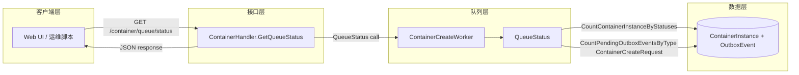

+++
title = '容器队列监控'
date = '2026-08-11T00:00:00+08:00'
draft = false
type = 'page'
layout = 'single'
weight = 25
+++

## 概述

本文档说明 gobrave 如何暴露容器创建队列健康状态、各监控字段的含义，以及队列状态在系统内部的计算方式。

该监控接口主要服务于运维与前端轮询场景，用于回答以下问题：

- 队列模式是否启用
- 当前有多少创建并发槽位被占用
- 还有多少创建请求在等待
- 当前配置的并发上限和排队上限是多少

## 架构



### 监控指标覆盖范围

- active_count：当前占用创建队列容量的容器实例数量
- pending_count：当前待处理的创建请求数量（create 类型 outbox pending）
- max_concurrency：创建并发上限配置
- max_pending：创建排队上限配置
- queue_enabled：队列模式是否可用（是否有可用 worker）

## API 契约

### 接口信息

- 方法：GET
- 路径：/container/queue/status
- 鉴权：需要 Bearer Token

### 响应字段

| 字段 | 类型 | 含义 |
|------|------|------|
| active_count | integer | 当前占用的创建并发容量 |
| pending_count | integer | 当前等待中的创建请求数 |
| max_concurrency | integer | 最大并发创建数量 |
| max_pending | integer | 最大可排队创建请求数量 |
| queue_enabled | boolean | 队列监控是否可用 |

### 响应模式

该接口在正常控制流下统一返回 HTTP 200，并通过字段值表达当前模式：

1. 队列关闭或 worker 未初始化

```json
{
	"active_count": 0,
	"pending_count": 0,
	"max_concurrency": 0,
	"max_pending": 0,
	"queue_enabled": false
}
```

2. 队列启用，但状态读取失败

```json
{
	"active_count": -1,
	"pending_count": -1,
	"max_concurrency": 3,
	"max_pending": 50,
	"queue_enabled": true
}
```

3. 队列启用，且状态读取成功

```json
{
	"active_count": 2,
	"pending_count": 7,
	"max_concurrency": 3,
	"max_pending": 50,
	"queue_enabled": true
}
```

## QueueStatus 的计算方式

`QueueStatus` 在同一个 repository 事务中读取两个计数：

- active_count：统计并发占用状态下的容器实例数
- pending_count：统计 `ContainerCreateRequest` 类型且状态为 pending 的 outbox 事件数

并发占用状态包括：

- creating
- running
- starting
- stopping

因此，`active_count` 是“容量占用”语义，不仅仅表示“正在创建中”。

## 配置映射

以下配置项直接影响监控结果：

```yaml
container:
	create_queue_enabled: false
	create_queue_max_concurrency: 3
	create_queue_max_pending: 50
```

| 配置项 | 对监控的影响 |
|--------|--------------|
| create_queue_enabled | 关闭时 queue worker 可能未接入，queue_enabled 会是 false |
| create_queue_max_concurrency | 对应响应中的 max_concurrency |
| create_queue_max_pending | 对应响应中的 max_pending |

## 运维判读

- 空闲健康：active_count 和 pending_count 长期接近 0
- 繁忙稳定：active_count 接近 max_concurrency，pending_count 有波动但可持续回落
- 持续饱和：active_count 长时间等于 max_concurrency，pending_count 持续增长
- 监控退化：active_count 和 pending_count 同时为 -1

## 告警建议

生产环境可使用以下基线规则：

- 队列饱和：active_count == max_concurrency 持续 5 分钟
- 队列积压风险：pending_count >= 0.8 * max_pending 持续 3 分钟
- 队列已满：pending_count >= max_pending 任意时刻触发
- 状态读取失败：active_count == -1 或 pending_count == -1

## 轮询建议

- UI 默认轮询周期：5 秒
- 低流量环境可放宽到 15-30 秒
- 当 queue_enabled 为 false 时，应停止队列负载轮询并隐藏相关容量指示

## 与运行时监控的关系

队列监控描述的是请求准入与生命周期处理阶段的压力。
运行时监控描述的是容器已经进入运行时后的存在性与引用关系。

建议联合使用：

- 队列指标用于解释“为什么启动延迟”
- 运行时指标用于解释“工作负载当前落在哪个运行时节点”
