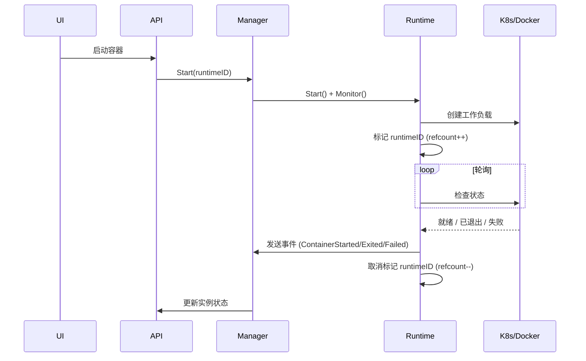

+++
title = '容器监控'
date = '2026-08-10T00:00:00+08:00'
draft = false
type = 'page'
layout = 'single'
weight = 25
+++

## 容器监控

容器监控系统提供 gobrave 管理的 Docker 容器和 Kubernetes 工作负载的运行时状态实时可见性。

### 概述

gobrave 自动监控容器生命周期事件——创建、启动、退出和失败——并通过 Web UI 和 REST API 暴露监控状态。全局监控注册表跟踪当前正在被观察的容器。

**支持的运行时：**

- **Docker**：监控 `docker run` 容器从启动到退出的全过程
- **Kubernetes**：监控 Deployment（Pod 就绪）和 Job（完成/失败）

### 工作原理



容器启动时，运行时：

1. 在全局监控注册表中以**引用计数**（refcount）注册 `runtimeID`。
2. 启动后台 goroutine 轮询底层平台（Docker API / Kubernetes API）。
3. 检测到状态变化时发出生命周期事件（`ContainerStarted`、`ContainerExited`、`ContainerFailed`、`ContainerDeleted`）。
4. 监控完成时递减 refcount。

引用计数机制允许多个并发观察者监控同一运行时。例如，Kubernetes Job 同时有启动就绪监控和退出监控两个引用——它们都被安全地跟踪和独立清理。

### API 端点

#### GET `/container/runtime/monitoring/list`

返回所有当前被监控运行时的快照。

**响应：**

```json
{
  "data": [
    {"runtime_id": "k8s-default|job|my-job", "ref_count": 1},
    {"runtime_id": "docker-abc123",          "ref_count": 1}
  ],
  "total": 2
}
```

| 字段 | 描述 |
|------|------|
| `runtime_id` | 运行时的唯一标识符 |
| `ref_count` | 活跃监控 goroutine 数量 |

#### POST `/container/instance/list-by-page`

每个容器实例项现在包含监控元数据：

| 字段 | 类型 | 描述 |
|------|------|------|
| `in_monitoring_registry` | `boolean` | 容器当前是否被监控 |
| `ref_count` | `number` | 活跃监控引用计数 |

### Web 界面

**容器实例列表**页新增两列：

- **Monitoring**：`Yes` / `No` —— 指示容器是否处于活跃监控中
- **RefCount**：显示当前监控引用计数（为零时显示 `-`）

可使用监控 API 构建自定义仪表板和告警流水线。

### 系统恢复

系统重启后，`RunRuntimeReconciler` 后台进程会：

1. 从数据库查询所有非终止状态的容器实例。
2. 与活跃监控注册表进行交叉比对。
3. 为仍应被跟踪的孤立容器重新附加监控。

这确保了监控自动恢复，无需人工干预。

### 架构设计

监控注册表面向可扩展性设计：

- **基于接口**：`MonitoringRegistry` 定义了 `Mark`、`Unmark`、`IsMonitoring`、`MarkIfNotMonitoring` 和 `Snapshot` 方法。
- **内存默认实现**：适用于单节点部署。
- **Redis 就绪**：接口可通过依赖注入（`BuildContainer`）替换为 Redis 后端，支持分布式部署。
- **线程安全**：所有操作在读/写互斥锁下原子执行。
