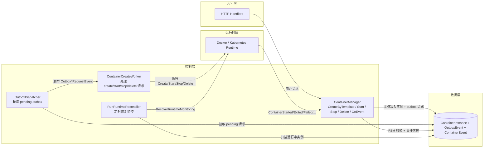
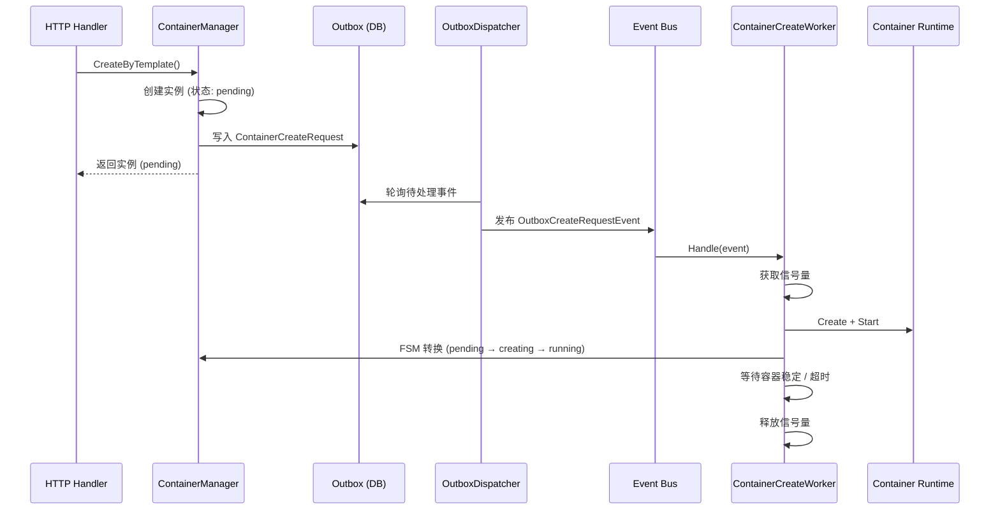
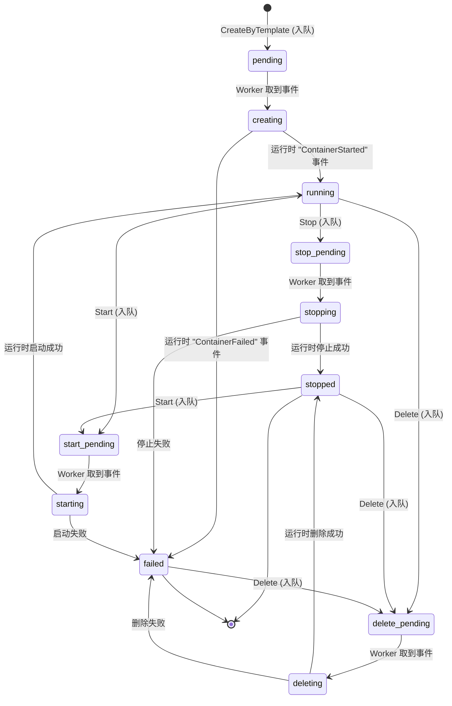
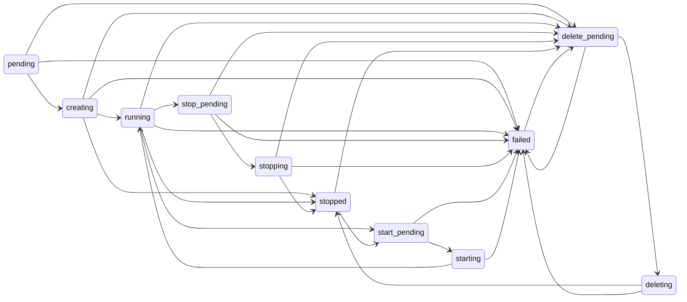

+++
title = '容器工作队列系统'
date = '2026-08-11T00:00:00+08:00'
draft = false
type = 'page'
layout = 'single'
weight = 26
+++

## 概述

gobrave 使用基于 outbox 模式的工作队列来异步管理所有容器生命周期操作。所有操作 — **创建**、**启动**、**停止**、**删除** — 不再直接调用容器运行时（Docker/K8s），而是通过 `ContainerCreateWorker` 入队，由事件总线异步处理。

该设计提供：

- **并发控制** — 通过信号量限制同时创建的容器数量。
- **容错能力** — 失败的操作通过 outbox 模式自动重试。
- **一致的状态机** — 所有操作遵循统一的 FSM 驱动的生命周期。
- **解耦** — HTTP 处理函数立即返回，容器操作在后台执行。

## 架构

### 核心组件架构图



该图展示了三个关键闭环：

- **请求闭环**：`ContainerManager` 将请求落到 outbox，`OutboxDispatcher` 分发给 `ContainerCreateWorker` 执行。
- **状态闭环**：运行时事件回流到 `ContainerManager.OnEvent`，通过 FSM 持久化容器状态与事件。
- **恢复闭环**：`RunRuntimeReconciler` 周期性恢复监控，并在 `RecoverRuntimeMonitoring` 中对 `RuntimeNodeName` 为空的 `running` 容器回填运行时节点信息。

### 创建请求时序（细化视图）



四种操作（创建、启动、停止、删除）均遵循相同模式：入队 → 分发 → 处理 → 标记完成。

## 容器生命周期状态

容器实例经历以下状态流转：



| 状态 | 描述 |
|-------|-------------|
| `pending` | 实例已创建，等待创建队列处理 |
| `creating` | Worker 正在创建运行时容器 |
| `running` | 容器正在运行 |
| `paused` | 容器已暂停（仅 Docker，已废弃） |
| `stop_pending` | 停止请求已入队，等待 Worker |
| `stopping` | Worker 正在停止容器 |
| `stopped` | 容器已停止 |
| `start_pending` | 启动请求已入队，等待 Worker |
| `starting` | Worker 正在启动容器 |
| `delete_pending` | 删除请求已入队，等待 Worker |
| `deleting` | Worker 正在删除容器 |
| `failed` | 操作失败 |
| `exited` | 容器自行退出 |

## 操作说明

### 创建容器

**API**: `POST /api/containers` → `ContainerManager.CreateByTemplate()`

**流程**:
1. 验证模板、镜像和运行时
2. 创建 `ContainerInstance`，状态为 `pending`
3. 将 `ContainerCreateRequest` 入队到 outbox
4. 立即返回实例

**Worker 处理**:
1. 获取信号量（控制最大并发数）
2. 通过 `ImageManager` 准备镜像
3. 解析环境变量、存储卷和调度约束
4. 解析运行时变量（如 `$USERID`、`$WORKSPACE_PATH`）
5. 调用 `rt.Create()` + `rt.Start()`
6. 状态转换: `pending` → `creating` →（等待 `ContainerStarted` 事件 → `running`）
7. 容器稳定或超时（5 分钟）后释放信号量

### 启动容器

**API**: `POST /api/containers/:id/start` → `ContainerManager.Start()`

**流程**:
1. 从 DB 加载实例
2. 转换为 `start_pending`
3. 将 `ContainerStartRequest` 入队到 outbox
4. 立即返回

**Worker 处理**:
1. 从实例解析运行时
2. 转换为 `starting`
3. 调用 `rt.Start()`
4. 运行时发出 `ContainerStarted` → `OnEvent` 转换为 `running`

### 停止容器

**API**: `POST /api/containers/:id/stop` → `ContainerManager.Stop()`

**流程**:
1. 从 DB 加载实例
2. 如果已是终态（`stopped`/`failed`/`exited`）则跳过
3. 转换为 `stop_pending`
4. 将 `ContainerStopRequest` 入队到 outbox
5. 立即返回

**Worker 处理**:
1. 加载实例并解析运行时
2. 如果已是终态则跳过
3. 转换为 `stopping`
4. 调用 `rt.Stop()`
5. 转换为 `stopped`（设置 `FinishedAt`）

### 删除容器

**API**: `DELETE /api/containers/:id` → `ContainerManager.Delete()`

**流程**:
1. 从 DB 加载实例
2. 如果已删除（`id == 0`）则跳过
3. 转换为 `delete_pending`
4. 将 `ContainerDeleteRequest` 入队到 outbox
5. 立即返回

**Worker 处理**:
1. 从 DB 加载实例
2. 转换为 `deleting`
3. 解析运行时并调用 `rt.Delete()`
4. 创建 `ContainerDeleted` 事件
5. 从 DB 删除实例

## Outbox 事件类型

| 事件类型 | 用于 | 负载 |
|------------|---------|---------|
| `ContainerCreateRequest` | 创建 | `containerCreatePayload` |
| `ContainerStartRequest` | 启动 | `containerStartPayload` |
| `ContainerStopRequest` | 停止 | `containerStopPayload` |
| `ContainerDeleteRequest` | 删除 | `containerDeletePayload` |

## 配置

配置位于 `config.yml` 的 `container` 部分：

```yaml
container:
  # 服务启动时刷新容器镜像状态
  refresh_image_status_on_start: true

  # 服务启动时恢复之前正在运行的 DAG
  recover_running_dag_on_start: true

  # 在 DAG 启动前清理旧的节点容器
  cleanup_dag_node_containers_before_start: true

  # 节点成功后自动删除容器
  delete_container_on_node_success: true

  # DAG 节点失败时的清理策略：none/stop/delete
  dag_node_cleanup_on_failed: stop

  # DAG 结束时的清理策略：none/stop/delete
  dag_node_cleanup_on_dag_finished: delete

  # 最大并发容器创建数
  create_queue_max_concurrency: 3

  # 最大待处理创建请求数
  create_queue_max_pending: 50
```

| 参数 | 默认值 | 描述 |
|-----------|---------|-------------|
| `refresh_image_status_on_start` | `true` | 服务启动时从运行时刷新容器镜像状态 |
| `recover_running_dag_on_start` | `true` | 服务重启后恢复之前正在运行的 DAG |
| `cleanup_dag_node_containers_before_start` | `true` | 在新 DAG 启动前清理旧的节点容器 |
| `delete_container_on_node_success` | `true` | 节点成功完成后自动删除容器 |
| `dag_node_cleanup_on_failed` | `stop` | DAG 节点失败时的清理策略（`none`、`stop`、`delete`） |
| `dag_node_cleanup_on_dag_finished` | `delete` | DAG 结束时的清理策略（`none`、`stop`、`delete`） |
| `create_queue_max_concurrency` | `3` | 最大同时创建容器数 |
| `create_queue_max_pending` | `50` | 最大排队创建请求数，超出后拒绝 |

启动、停止和删除请求无队列限制 — 始终接受。

## 错误处理

- 如果 Worker 处理请求失败（如运行时错误），outbox 事件标记为 `pending` 以便重试。
- `OutboxDispatcher` 每秒轮询一次，重试待处理事件。
- Worker 的信号量防止创建高峰时的资源耗尽。
- 创建有 5 分钟的启动超时；如果容器在此期间内未稳定，信号量仍会被释放。

## FSM 转换规则

完整的 FSM 定义在 `internal/fsm/container_fsm.go`。禁止的转换（如 `stopped` → `creating`）会返回 `"invalid transition"` 错误。


