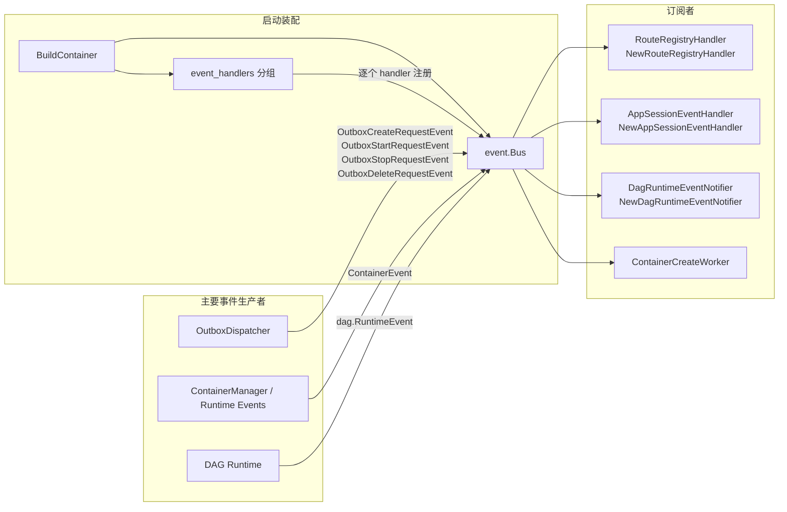

+++
title = 'Event Bus 订阅者（event_handlers）'
date = '2026-08-11T00:00:00+08:00'
draft = false
type = 'page'
layout = 'single'
weight = 27
+++

## 概述

本文说明通过 `event_handlers` 依赖注入分组订阅到共享事件总线的所有处理器，以及它们面向用户的架构职责。

该分组中已注册的订阅者为：

- NewRouteRegistryHandler
- NewAppSessionEventHandler
- NewDagRuntimeEventNotifier
- ContainerCreateWorker

系统启动时会遍历 `event_handlers` 分组并调用 `bus.Subscribe(handler)`，将这些处理器统一订阅到总线上。

## 订阅架构

## 各订阅者作用

### 1) NewRouteRegistryHandler

核心作用：将 App Session 容器生命周期与外部路由记录保持同步。

- 消费事件：ContainerEvent
- 处理范围：仅 `owner_type = app_session` 的容器
- 在 `ContainerStarted` / `ContainerResumed` 时：
  - 根据容器 IP 与模板端口构建后端路由
  - 写入或更新路由注册中心（gateway、Traefik、K8s ingress 适配器）
- 在 `ContainerStopped` / `ContainerDeleted` / `ContainerFailed` 时：
  - 从注册中心删除路由

用户影响：

- App Session 只有在容器真正可用后才会被路由访问。
- 容器停止或失败后路由会自动回收，避免流量打到失效后端。

### 2) NewAppSessionEventHandler

核心作用：把容器生命周期事件映射为 AppSession 状态，保证 UI 与 API 状态一致。

- 消费事件：ContainerEvent
- 处理范围：仅 `owner_type = app_session` 的容器
- 归一化事件状态（creating/running/stopped/failed）
- 更新 AppSession 字段：
  - Status
  - StartedAt
  - StoppedAt

用户影响：

- UI 中看到的 App Session 状态与真实容器状态保持一致。
- 启停时间戳与运行时行为对齐。

### 3) NewDagRuntimeEventNotifier

核心作用：将 DAG 运行时事件转换为前端实时动作消息。

- 消费事件：dag.RuntimeEvent
- 仅处理关键 DAG 与节点生命周期事件
- 解析项目成员后，通过 realtime Hub 推送消息
- 产出前端动作方法例如：
  - dagStarted
  - dagDone
  - analysisSubmitted
  - analysisStarted
  - analysisDone

用户影响：

- 同一项目用户可近实时看到 DAG/节点状态变化。
- DAG 进度可无刷新更新。

### 4) ContainerCreateWorker

核心作用：消费 outbox 请求事件，带队列控制地异步执行容器操作。

- 消费事件：
  - OutboxCreateRequestEvent
  - OutboxStartRequestEvent
  - OutboxStopRequestEvent
  - OutboxDeleteRequestEvent
- 异步执行运行时操作：
  - create + start
  - start
  - stop
  - delete
- 负责状态迁移与 outbox 状态更新
- 强制执行创建队列限制（最大并发、最大排队）

用户影响：

- 容器 API 可快速返回，重操作在后台执行。
- 高并发突发场景下通过排队和限流保持系统稳定。
- 失败任务可通过 outbox 状态回退继续重试。

## 事件与订阅者对应矩阵

| 事件类型 | RouteRegistryHandler | AppSessionEventHandler | DagRuntimeEventNotifier | ContainerCreateWorker |
|----------|----------------------|------------------------|-------------------------|-----------------------|
| ContainerEvent | 是 | 是 | 否 | 否 |
| dag.RuntimeEvent | 否 | 否 | 是 | 否 |
| OutboxCreateRequestEvent | 否 | 否 | 否 | 是 |
| OutboxStartRequestEvent | 否 | 否 | 否 | 是 |
| OutboxStopRequestEvent | 否 | 否 | 否 | 是 |
| OutboxDeleteRequestEvent | 否 | 否 | 否 | 是 |

## 端到端用户流程

1. 用户发起 App Session 启动，或触发 DAG 节点运行。
2. 系统写入生命周期事件和 outbox 事件。
3. OutboxDispatcher 与运行时组件将事件发布到共享总线。
4. 各订阅者独立响应：
   - ContainerCreateWorker 执行运行时操作。
   - AppSessionEventHandler 更新会话状态。
   - RouteRegistryHandler 同步路由可达性。
   - DagRuntimeEventNotifier 推送实时 UI 更新。
5. 用户最终看到一致的状态、可用路由和实时进度。

这种职责拆分使架构保持事件驱动、低耦合且易扩展。
