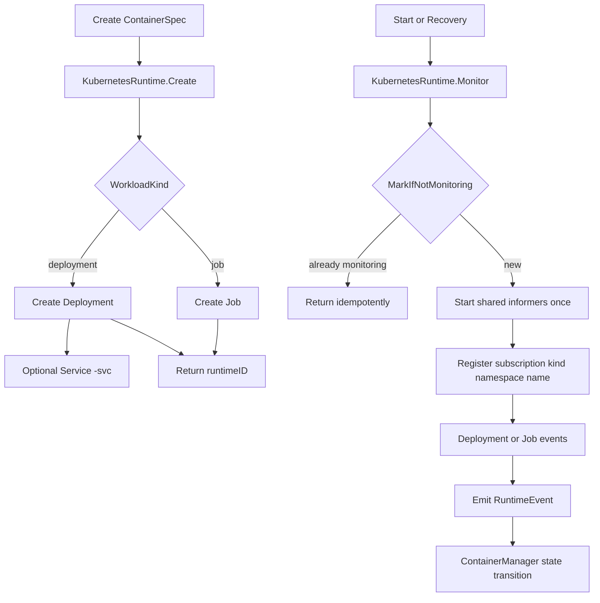

+++
title = 'Kubernetes 运行时架构'
date = '2026-08-12T00:00:00+08:00'
draft = false
type = 'page'
layout = 'single'
weight = 27
+++

## 概述

本文说明 gobrave 当前使用的 Kubernetes 运行时架构。

该实现基于以下代码：

- `internal/container_runtime/kubernetes/runtime.go`
- `internal/container_runtime/kubernetes/monitor_v2.go`

运行时支持两类工作负载：

- `deployment`（长运行服务）
- `job`（一次性执行任务）

## 架构目标

1. 在大规模场景下保持运行时监控高效。
2. 避免同一个 runtime ID 启动重复监控循环。
3. 将 Kubernetes 工作负载状态转换为稳定的 gobrave 运行时事件。
4. 让用户侧生命周期行为保持可预测（`start`、`stop`、`delete`、`logs`、`inspect`）。

## 高层流程

## Runtime ID 模型

Runtime ID 编码格式为：

`<runtimeName>-<namespace>|<kind>|<name>`

示例：

- `k8s-default|deployment|web-api`
- `k3s-ai|job|batch-import-001`

该格式是 `Start`、`Stop`、`Delete`、`Logs`、`Inspect` 等运行时操作的前提。

## 资源创建模型

### Deployment 路径

当 `WorkloadKind` 为 `deployment`（或为空，默认值）时：

1. 创建 Deployment，并带上标签：
- `app=<workloadName>`
- `gobrave-workload=<workloadName>`
2. 若 `ExposeService=true` 且 `ExposedPort>0`，创建名为 `<workloadName>-svc` 的 ClusterIP Service。
3. 返回 runtime ID。

### Job 路径

当 `WorkloadKind` 为 `job` 时：

1. 创建 Job，并带上标签：
- `app=<workloadName>`
- `gobrave-workload=<workloadName>`
2. 返回 runtime ID。

### 命名空间解析

命名空间优先级：

1. `spec.RuntimeNamespace`
2. 运行时配置中的 namespace
3. `default`

## Pod Spec 映射（用户可见行为）

从 `ContainerSpec` 到 Kubernetes Pod 规范的映射：

- `Image`、`Entrypoint`、`Command`、`WorkDir` 直接映射。
- `Env` 注入前按 key 排序（确保输出确定性）。
- `CPU` 与 `Memory` 映射到容器资源限制。
- `Volumes` 映射为 `hostPath` 挂载。
- `User`（数字 uid 或 `uid:gid`）在可解析时映射到 `RunAsUser`。
- `ExposedPort` 增加容器端口。
- `node` 类型调度约束映射到 required node affinity。

重启策略：

- Deployment：`Always`
- Job：`Never`

## 监控架构（Informer 驱动）

`KubernetesRuntime` 默认使用 `monitor_v2`。

### 关键设计

1. 共享 informer 在运行时进程内只启动一次。
2. 通过 `MarkIfNotMonitoring(runtimeID)` 保证监控注册幂等。
3. 订阅键为 `kind|namespace|name`。
4. 注册订阅后会立即执行一次快照检查。

### 使用的 Informer

- Deployment informer：add/update/delete
- Job informer：add/update/delete

### 为什么需要快照检查

在等待 informer 事件之前，运行时会对目标工作负载执行一次直接 `Get`。
这能避免错过注册前刚刚发生的启动或终态信号。

## 事件映射

运行时向 `ContainerManager` 发出以下事件：

### Job

- 启动：`Status.Active > 0` 或 `Status.StartTime != nil` -> `ContainerStarted`
- 成功：`Status.Succeeded > 0` -> `ContainerExited`，消息为 `0`
- 失败：`Status.Failed > 0` -> `ContainerFailed`，消息取 condition message 或 failed count
- 删除/未找到：delete 事件或查询未找到 -> `ContainerDeleted`

### Deployment

- 启动：`Status.ReadyReplicas > 0` -> `ContainerStarted`
- 失败：副本失败或进度超时 -> `ContainerFailed`
- 退出：`spec.replicas == 0` 且 `status.replicas == 0` -> `ContainerExited`，消息为 `0`
- 删除/未找到：delete 事件或查询未找到 -> `ContainerDeleted`

发出终态事件后，会移除订阅并取消该 runtime ID 的监控成员标记。

## 生命周期语义

### Start

- Deployment：扩容到 1，然后开始监控。
- Job：校验 Job 存在，然后开始监控。

### Stop 与 Pause

- Deployment：缩容到 0。
- Job：删除 Job（foreground propagation）。
- `Pause` 当前实现等同于 `Stop`。

### Resume

- `Resume` 当前实现等同于 `Start`。

### Delete

- Deployment：删除 Service `<name>-svc`（忽略 not found），再删除 Deployment。
- Job：删除 Job（foreground propagation）。

## 日志与 Inspect

### Logs

`Logs(runtimeID, tail)`：

1. 从 runtime ID 解析工作负载元信息。
2. 按标签 `gobrave-workload=<name>` 找到最新 Pod。
3. 读取 Pod 日志（默认 tail：200 行）。

### Inspect

- Deployment：
    - `IPAddress` 返回服务 DNS：`<name>-svc.<namespace>.svc.cluster.local`
    - `NodeName` 在可用时取最新 Pod 的节点名
- Job：
    - `IPAddress` 为 Pod IP
    - `NodeName` 为 Pod 所在节点

## 限制与兼容性说明

- 支持的运行时名称：`k8s`、`k3s`。
- `EnsureImage` 接受拉取策略 `Always` 与 `IfNotPresent`。
- 预检会拒绝拉取策略 `Never`。
- `Exec` 目前尚未实现。
- 被删除的 Job 不能以同名工作负载重新启动。

## 运行建议

1. 始终为受管工作负载保留 `gobrave-workload` 标签。
2. 使用单运行时进程 + 共享 informer，不要为每个工作负载单独建客户端。
3. 可重复调用监控注册逻辑（其本身是安全幂等的）。
4. 保持重启恢复能力开启，使进程重启后可重新接管非终态 runtime ID。

## 排障清单

1. 没有收到生命周期更新：
- 检查 runtime ID 格式和运行时前缀（`k8s-` 或 `k3s-`）。
- 检查 informer 启动与缓存同步错误。

2. Deployment 一直不上报 started：
- 检查 `ReadyReplicas` 与 Pod 调度状态。
- 检查 Deployment 失败条件（`ReplicaFailure`、`ProgressDeadlineExceeded`）。

3. Job 未发出终态事件：
- 检查 `Succeeded` / `Failed` 字段与 Job conditions。
- 检查 Job 是否在监控注册前已被删除。

## 相关文档

- 运行时监控恢复：`/docs/runtime-monitor-recovery`
- 容器监控与队列状态：`/docs/container-monitoring`
- 事件订阅者：`/docs/event-bus-subscribers`
