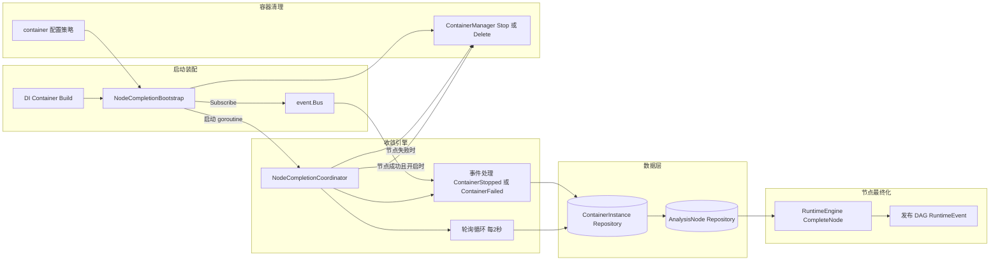

+++
title = 'Node Completion Bootstrap 架构'
date = '2026-08-11T00:00:00+08:00'
draft = false
type = 'page'
layout = 'single'
weight = 28
+++

## 概述

NodeCompletionBootstrap 是用于启动装配的基础组件，负责保证 DAG 分析节点在其运行容器进入终态后能够被最终收敛（finalize）。

它通过以下方式把基础设施关注点与 DAG 编排业务解耦：

- 构建并注入 NodeCompletionCoordinator（含清理策略）
- 将 coordinator 订阅到容器生命周期事件总线
- 启动后台轮询兜底收敛循环

即使发生进程重启、事件漏投或短暂总线抖动，也能保证节点状态最终一致。

## 架构图



## 启动时序

服务启动时：

1. DI 注册 NodeCompletionBootstrap。
2. 启动阶段调用 bootstrap.Start(context.Background())。
3. Start 由 sync.Once 保护，重复调用不会重复启动。
4. coordinator 订阅共享 event bus。
5. 后台收敛循环启动，固定每 2 秒执行一次。

这种事件驱动 + 轮询兜底的双机制同时兼顾低延迟与最终一致性。

## 收敛触发来源

NodeCompletionCoordinator 有两类触发：

- 事件触发：
  - 处理 ContainerStopped
  - 处理 ContainerFailed
- 轮询触发：
  - 周期性扫描容器实例
  - 对 DAG 节点所属且已终态的容器执行收敛（stopped/failed/exited）

同时，按 container instance ID 维护 in-flight 防重入，避免同一容器被并发重复收敛。

## 节点完成判定逻辑

对每个终态 DAG 节点容器，coordinator 执行：

1. 加载所属 analysis node
2. 过滤不需要收敛的节点状态
3. 将容器终态映射为节点终态
4. 根据 output patterns 与 outputs.json 解析输出
5. 调用 RuntimeEngine.CompleteNode 完成节点
6. 发布运行时事件供 UI 与下游消费

状态映射规则：

- ContainerFailed -> failed（exit code 缺失时默认 1）
- ContainerStopped 或 ContainerExited 且 exit code = 0 -> done
- ContainerStopped 或 ContainerExited 且 exit code != 0 -> failed
- 若节点当前为 stopping 且容器终态 -> stopped

## 清理职责

NodeCompletionBootstrap 负责向 coordinator 注入清理策略行为。

### 节点失败后清理

清理策略来自 container.dag_node_cleanup_on_failed：

- none：不处理
- stop：停止该节点所属容器
- delete：删除该节点所属容器

bootstrap 会查询该节点 owner 下的容器实例，并通过 ContainerManager 执行策略。

### 节点成功后清理

当 container.delete_container_on_node_success = true 时，coordinator 会删除成功节点对应容器。

## 配置项

相关 container 配置：

```yaml
container:
  delete_container_on_node_success: true
  dag_node_cleanup_on_failed: stop
```

语义说明：

- delete_container_on_node_success：控制节点成功后是否删除容器
- dag_node_cleanup_on_failed：控制节点失败后的清理模式（none/stop/delete）

## 端到端用户流程

1. 一个 DAG 节点在运行容器中执行。
2. 容器退出（成功或失败）。
3. coordinator 通过事件即时触发，或由轮询兜底捕获。
4. coordinator 完成节点状态与输出收敛。
5. 根据策略执行可选容器清理。
6. 发布 RuntimeEvent 以驱动实时前端更新。

最终效果：即使系统重启或事件短暂漏投，用户看到的 DAG 节点终态仍然保持一致。