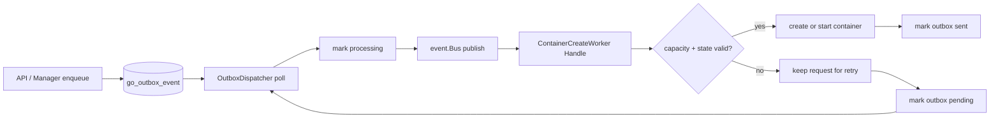

+++
title = 'Outbox 分发器与 Worker 并发控制'
date = '2026-08-11T00:00:00+08:00'
draft = false
type = 'page'
layout = 'single'
weight = 28
+++

## 概述

本文说明 `RunOutboxDispatcher`、`OutboxDispatcher` 与 `ContainerCreateWorker` 如何协同，为 `ContainerInstance` 实现队列背压与运行时并发控制。

核心目标：

- 限制同时执行的容器创建/启动操作数量（`maxConcurrency`）。
- 限制可排队等待的创建请求数量（`maxPending`）。
- 通过 `OutboxEvent` + 事件总线保持请求异步化。

## 组件与职责

### `RunOutboxDispatcher`

- 在 goroutine 中启动分发循环。
- 异步调用 `dispatcher.Start(context.Background())`。

```go
func RunOutboxDispatcher(dispatcher *OutboxDispatcher) {
    go dispatcher.Start(context.Background())
}
```

### `OutboxDispatcher`

- 轮询待处理 outbox 记录（`ListPendingOutboxEvent`）。
- 发布前将每个请求标记为 `processing`。
- 向事件总线发布类型化请求事件：
  - `OutboxCreateRequestEvent`
  - `OutboxStartRequestEvent`
  - `OutboxStopRequestEvent`
  - `OutboxDeleteRequestEvent`

### `ContainerCreateWorker`

- 订阅上述总线事件。
- 异步处理 create/start/stop/delete。
- 对 create/start 请求通过 `acquireCapacityAndTransition` 做容量检查。
- 成功后将 outbox 标记为 `sent`，可重试失败则回退为 `pending`。

## 事件总线流程



## `ContainerInstance` 状态与排队行为

### 创建请求路径

1. 创建 API 在同一个 DB 事务内完成队列检查与入队。
2. 事务会检查待处理创建请求数是否超过 `maxPending`。
3. 若待处理创建请求已大于等于 `maxPending`，事务返回错误并回滚，因此不会创建 `ContainerInstance` 和 `OutboxEvent`。
4. 若可接受，同一事务写入：
  - `ContainerInstance{status: pending}`
  - `OutboxEvent{Type: ContainerCreateRequest, Status: pending}`
5. `OutboxDispatcher` 发布 `OutboxCreateRequestEvent`。
6. `ContainerCreateWorker` 处理事件并调用 `acquireCapacityAndTransition`。

### 容量判定（`maxConcurrency`）

- Worker 会统计当前占用并发槽位的活跃容器实例。
- 若活跃数小于 `maxConcurrency`，允许迁移，容器进入 `creating`，随后进入 `running`。
- 若活跃数大于等于 `maxConcurrency`，本轮拒绝容量，请求不会执行。

拒绝时结果：

- 当前 `ContainerInstance` 保持 `pending`（或启动流程中的 `start_pending`）。
- 对应 outbox 请求回退为 `pending`。
- 下一轮 `OutboxDispatcher` 轮询会继续重试。

## 状态迁移摘要

针对本文讨论的创建生命周期：

- `pending` -> `creating` -> `running`（容量可用时）
- `pending` -> `pending`（本轮容量不足，逻辑重试）

在同一机制下的启动生命周期：

- `start_pending` -> `starting` -> `running`（容量可用时）
- `start_pending` -> `start_pending`（本轮容量不足，逻辑重试）

## `maxPending` 与 `maxConcurrency` 的协同

- `maxPending` 在入队时保护队列长度。
- `maxConcurrency` 在执行时保护运行时压力。
- 组合行为：
  - 队列过长：立即拒绝新创建请求（不生成 `OutboxEvent`）。
  - 队列可接收但运行时繁忙：请求保持可重试，由下一轮分发继续尝试。

这实现了队列增长有界与并发执行有界的双重保障。
