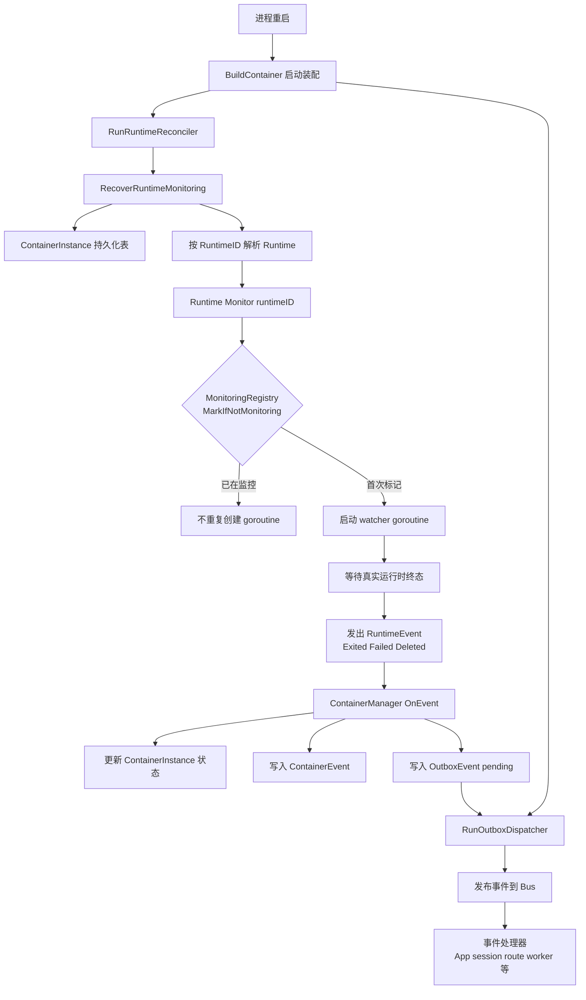

+++
title = '重启后运行时监控恢复'
date = '2026-08-11T00:00:00+08:00'
draft = false
type = 'page'
layout = 'single'
weight = 26
+++

## 概述

本文说明 gobrave 在进程重启后，如何恢复运行时监控 goroutine，核心机制包括：

- `RunRuntimeReconciler`：周期性监控恢复
- `MonitoringRegistry`：幂等监控成员管理
- 运行时 `Monitor(...)` 实现：按 runtime 重新拉起 watcher goroutine

目标是让 `ContainerInstance` 状态与真实运行时状态保持一致，并确保容器终态事件能继续进入事件管道。

## 为什么需要恢复

服务重启后，内存中的 goroutine 会丢失，包括运行时退出监听器。
如果不恢复，容器可能已经在运行时结束，但持久化的 `ContainerInstance` 仍停留在 `running` 或 `creating`。

## 启动与周期恢复

系统启动时，依赖注入会触发：

- `ContainerManager.RunRuntimeReconciler(context.Background(), 30*time.Second)`

`RunRuntimeReconciler` 行为：

1. 启动后立刻执行一次恢复
2. 之后按间隔周期执行恢复（默认 30 秒）

每次恢复都会调用 `RecoverRuntimeMonitoring`，其处理步骤为：

- 读取持久化 `ContainerInstance` 列表
- 筛选需要恢复监控的实例（`creating`、`paused`、`running` 且 runtime ID 非空）
- 解析并定位对应 runtime 实现
- 若 runtime 实现了 `RuntimeMonitor`，则调用 `Monitor(ctx, runtimeID)`

## MonitoringRegistry 的作用

`MonitoringRegistry` 用于监控 goroutine 成员管理并防止重复 watcher：

- `MarkIfNotMonitoring(runtimeID)` 通过原子方式仅在未监控时标记
- 对同一 runtime ID 的重复恢复调用是安全且幂等的
- watcher goroutine 退出时调用 `Unmark(runtimeID)`
- 可通过 `Snapshot()` 查看当前监控引用计数用于诊断

因此，对账器可以高频重复执行，而不会无界创建重复 goroutine。

## Runtime Monitor 的行为

运行时实现（`docker`、`k8s/k3s`）会先调用 `MarkIfNotMonitoring`，再决定是否启动 watcher goroutine。
若已在监控中，则直接返回。

典型 watcher 行为：

- 等待容器或工作负载进入终态
- 发出运行时事件（如 `ContainerExited`、`ContainerFailed`、`ContainerDeleted`）
- goroutine 退出前执行监控反注册

## 状态一致性：ContainerInstance 与真实运行态

当运行时事件进入 `ContainerManager.OnEvent(...)` 后，管理器会推进持久化 `ContainerInstance` 状态：

- `ContainerStarted` -> `running`
- `ContainerExited` -> `stopped`
- `ContainerFailed` -> `failed`
- `ContainerDeleted` -> `stopped`

状态迁移过程会同步更新：

- 实例状态
- 启动和结束时间戳
- 容器事件记录

这保证了持久化状态可收敛到真实运行时终态。

## 事件如何送达 Bus

对于状态迁移事件，管理器会先写入 `pending` outbox 记录，并携带序列化后的 `ContainerEvent` 负载。
随后 outbox 分发器会将这些事件发布到 bus，下游处理器即使在重启后也能继续消费。

由于启动阶段会同时拉起 reconciler 与 outbox dispatcher，监控恢复后观测到的终态事件仍会沿既有事件管道传播。

## 架构图

## 运维要点

- 恢复是最终一致，不是瞬时一致，收敛时间受 reconciler 间隔约束。
- 通过注册表原子检查可避免重复创建 watcher。
- 终态事件先持久化再分发，因此重启后仍具备可靠投递能力。
- 若某 runtime 未实现 `RuntimeMonitor`，恢复逻辑会跳过该 runtime。
