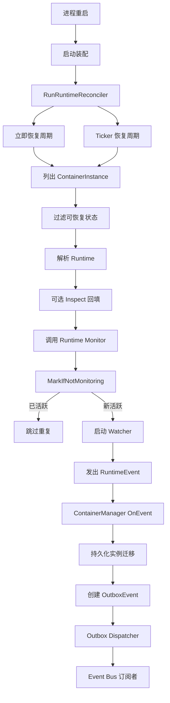

+++
title = '重启后运行时监控恢复'
date = '2026-08-11T00:00:00+08:00'
draft = false
type = 'page'
layout = 'single'
weight = 26
+++

## 概述

本文说明 gobrave 在进程重启后，如何恢复运行时生命周期监控。

当前恢复路径基于：

- `ContainerManager.RunRuntimeReconciler(...)`
- `ContainerManager.RecoverRuntimeMonitoring(...)`
- 运行时 `Monitor(ctx, runtimeID)` 实现
- 进程全局 `MonitoringRegistry` 幂等保护

目标是为可恢复的容器实例重新附加监控，并让运行时事件继续进入正常状态迁移管道。

## 为什么需要恢复

服务重启后，内存中的监控 goroutine 会丢失。
如果不执行恢复，运行时状态可能已经变化，但持久化的 `ContainerInstance` 状态仍然陈旧。

## 启动与周期性恢复

系统启动时，依赖注入会触发：

- `ContainerManager.RunRuntimeReconciler(context.Background(), 600*time.Second)`

`RunRuntimeReconciler` 会执行：

1. 启动时立即恢复一次
2. 按配置间隔进行周期恢复

若 `interval <= 0`，reconciler 会回退到 `300s`。

每次恢复都会调用 `RecoverRuntimeMonitoring`，其处理步骤为：

- 读取持久化 `ContainerInstance` 记录
- 过滤可进行监控恢复的记录
- 根据实例运行时信息解析运行时实现
- 对运行中实例按需回填运行时 inspect 信息
- 当运行时支持 `RuntimeMonitor` 时调用 `Monitor(ctx, runtimeID)`
- 按实例记录恢复成功或失败日志，并继续扫描后续实例

可恢复状态包括：

- `creating`
- `paused`
- `running`
- `failed`

runtime ID 为空的实例会被跳过。

## MonitoringRegistry 的作用

`MonitoringRegistry` 用于监控 goroutine 成员管理并防止重复 watcher：

- `MarkIfNotMonitoring(runtimeID)` 通过原子方式仅在未监控时标记
- 对同一 runtime ID 的重复恢复调用是安全且幂等的
- watcher 退出或订阅完成时调用 `UnmarkRuntimeMonitoring(runtimeID)`
- `RuntimeMonitoringSnapshot()` 暴露 runtime ID 到计数的映射，便于诊断

因此，reconciler 可以重复运行而不会创建重复的活跃监控器。

## Runtime Monitor 行为

运行时实现（`docker`、`k8s/k3s`）在启动 watcher goroutine 前会先调用 `MarkIfNotMonitoring`。
若该 runtime 已在监控中，则直接返回。

典型 watcher 行为：

- 等待容器或工作负载进入终态
- 发出运行时事件（如 `ContainerExited`、`ContainerFailed`、`ContainerDeleted`）
- goroutine 退出时取消监控成员标记

## 恢复期间的运行时 Inspect 回填

在调用 `Monitor` 前，恢复流程会在满足以下全部条件时做一次尽力而为的 inspect 同步：

- 实例状态是 `running`
- runtime ID 非空
- `RuntimeNodeName` 为空

若运行时支持 `RuntimeInspector`，管理器会调用 `Inspect` 并持久化变更后的 `IPAddress` 或 `RuntimeNodeName`。

## 状态一致性与事件管道

恢复流程本身不会发出合成的对账事件。
状态变化仍通过运行时监控事件进入 `ContainerManager.OnEvent`。

典型状态迁移为：

- `ContainerStarted` -> `running`
- `ContainerExited` -> `stopped`
- `ContainerFailed` -> `failed`
- `ContainerDeleted` -> `stopped`

状态迁移处理会持久化容器实例更新，并写出 outbox 事件供下游订阅者消费。

## 事件如何送达 Bus

对于状态迁移事件，管理器会写入包含序列化容器事件负载的 outbox 记录。
随后 outbox 分发器将事件发布到 bus，使下游处理器在重启后仍可继续响应。

由于 reconciler 与 dispatcher 都在启动时运行，恢复后的运行时事件会沿同一条持久化管道投递。

## 架构

## 运维说明

1. 恢复属于最终一致，收敛时间受 reconciler 周期约束。
2. reconciler 启动后总会立刻执行一次恢复。
3. 周期恢复仅在 `recovered > 0` 时记录成功日志。
4. 某个实例恢复失败不会中断整轮扫描。
5. 若运行时未实现 `RuntimeMonitor`，该实例会被跳过。
6. `MarkIfNotMonitoring` 保证监控去重。

## 排障清单

1. 启动恢复未执行：
- 检查启动日志中是否出现 `startup runtime monitor recovery`。
- 确认容器启动装配中已接入 `RunRuntimeReconciler`。

2. 实例被意外跳过：
- 确认实例状态属于 `creating`、`paused`、`running`、`failed`。
- 确认 runtime ID 非空。
- 确认可通过实例运行时元数据解析到对应 runtime。

3. 没有周期恢复日志：
- 仅当恢复计数大于 0 时才会输出周期成功日志。
- 检查周期恢复失败相关 warning 日志。

4. 担心重复监控：
- 使用运行时监控快照接口核对当前被监控的 runtime ID 及计数。
